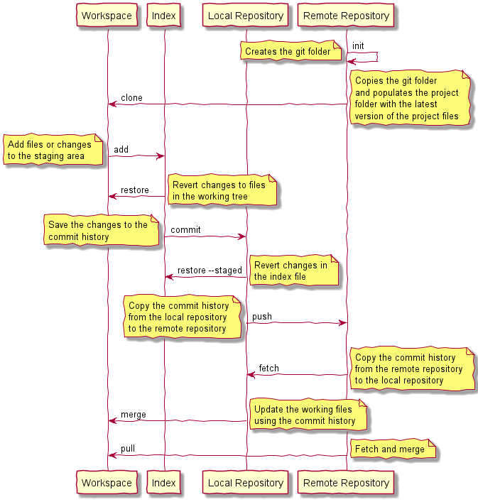

## Git Dataflow

[**Content**](../README.md) |
[**Intro**](../01-Introduction/introduction.md) |
[**Concepts**](../02-Concepts/concepts.md) |
[**Operations**](../03-Operations/operations.md) |
[**Dictionary**](../04-Appendix/dictionary.md)
________________________________________________________________________________

The following diagram shows an overview of the git data model and the 
basic commands used to transfer data between the storage locations.

-------------------------------------------------------------------------------
### Repository
The repo contains the files as well as the history of the changes made to those 
files. The history is a collection of snapshots at different points of time.
The repository can be either **local** or **remote**. For git both types of 
repositories are equivalent.

-------------------------------------------------------------------------------
### Workspace
The workspace or worktree is the project on the local machine's filesystem. 
All the changes will remain in the working directory until they are 
added to the staging area or discarded.

-------------------------------------------------------------------------------
### Index
The index or also ***staging area*** is the place where the developer gathers and 
groups the changes before commit.

-------------------------------------------------------------------------------
### Practice
1. Create a remote repository on GitHub
2. Clone the remote repository
3. Create a new file test.txt and add it to the index
4. Add the file to the index
5. Commit the file to the local repo
6. Push the file to the remote repo
7. Change the file test.txt on GitHub
8. Pull the changes from the remote repo
9. Check the contents of the file test.txt
