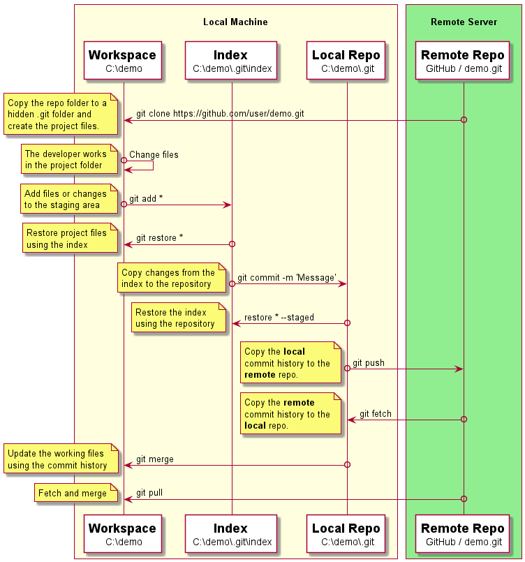

## Git Dataflow

-------------------------------------------------------------------------------
### Repository
It contains the files as well as the history of the changes made to those 
files. The repository can be either **local** or **remote**. For git 
both types of repositories are equivalent.

-------------------------------------------------------------------------------
### Workspace
The workspace or worktree is the project on the local machine's filesystem. 
All the changes you made will remain in the working directory until they are 
added to the staging area or discarded.

-------------------------------------------------------------------------------
### Index

The staging area or also index is the place where the developer gathers and 
groups the changes before commit.

-------------------------------------------------------------------------------
### Practice

1. Create a remote repository
2. Clone the remote repository
3. Create a new file and add it to the index
4. Add the file to the index
5. Commit the file to the local repo
6. Push the file to the remote repo
7. Simulate a change from another developer
8. Pull the changes from the remote repo
9. Check the contents of hello.txt
