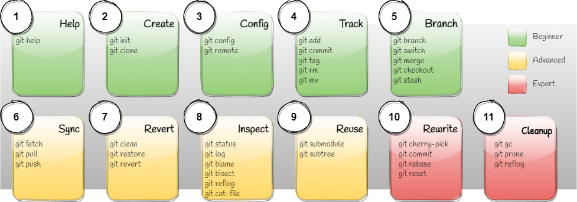

## Git Operations Overview

-------------------------------------------------------------------------------
### 1. Help
Get help about any given command.

-------------------------------------------------------------------------------
### 2. Create
Create a local or remote repository.

-------------------------------------------------------------------------------
### 3. Config
Configure the local repository.

-------------------------------------------------------------------------------
### 4. Track
Save, track and label changes.

-------------------------------------------------------------------------------
### 5. Branch
Branch, switch and merge branches.

-------------------------------------------------------------------------------
### 6. Sync
Collaborate with other developers.

-------------------------------------------------------------------------------
### 7. Revert
Revert changes to the project files using the index or the local commit history.

-------------------------------------------------------------------------------
### 8. Inspect
Inspect the commit history, check the author of the modifications, get the 
repository status and other operations.

-------------------------------------------------------------------------------
### 9. Rewrite
Delete, modify or filter out parts of the commit history.

-------------------------------------------------------------------------------
### 10. Automate
Use advanced techniques to automate some of the git operations.

