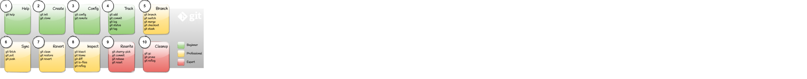

## Git Operations Overview



-------------------------------------------------------------------------------
### 1. Help
Get help about any given command, guide or configuration 

```shell
$ git help
$ git help --guides
$ git help --config
```
-------------------------------------------------------------------------------
### 2. Create
Create a local or remote repository.

```shell
$ git clone https://github.com/user/demo.git
```
-------------------------------------------------------------------------------
### 3. Config
Configure the local repository.

```shell
$ git config --global user.email "user@mail.com"
$ git config user.email
```

-------------------------------------------------------------------------------
### 4. Track
Save, track and label changes.

```shell
# Create a new file
$ echo 123 > README.md
$ git status

# Start tracking
$ git add *
$ git status

# Save the changes
$ git commit -m 'Commit message'
$ git status

# Label a specific change
$ git tag V1.0
$ git tag

# Show history
$ git log
```

-------------------------------------------------------------------------------
### 5. Branch
Branch, stash and merge branches.

```shell
# Create branch and switch to it
$ git branch test
$ git branch
$ git switch test
$ git branch

# Do some work
$ echo 1 > README.md
$ git add *
$ git commit
$ echo 2 > README.md
$ git add *

# Try to switch to main before commit
$ git switch main

# Save changes
$ git stash
$ git stash list
$ git stash show

# Switch to main, restore changes and commit
$ git switch main
$ git switch test
$ git stash pop
$ git commit -m 'File changed in branch'

# Merge changes from test
$ git switch main
$ git merge test

# Go to V1.0 and switch back
$ git checkout V1.0
$ git branch
$ git switch main
$ git branch
```

-------------------------------------------------------------------------------
### 6. Sync
Collaborate with other developers.

```shell
$ git push
$ git push origin test

$ git pull
$ git pull origin test
```

-------------------------------------------------------------------------------
### 7. Revert
Revert changes to the project files using the index or the local commit history.

```shell
# Restore file from index
$ del README.md
$ git status
$ git restore *
$ git status

# Restore index from commit history
$ echo ABCD > README.md
$ git add *
$ git status
$ git restore --staged
$ git status
```
-------------------------------------------------------------------------------
### 8. Inspect
Inspect the commit history, check the author of the modifications, get the 
repository status and other operations.

-------------------------------------------------------------------------------
### 9. Rewrite
Delete, modify or filter out parts of the commit history.

-------------------------------------------------------------------------------
### 10. Automate
Use advanced techniques to automate some of the git operations.

