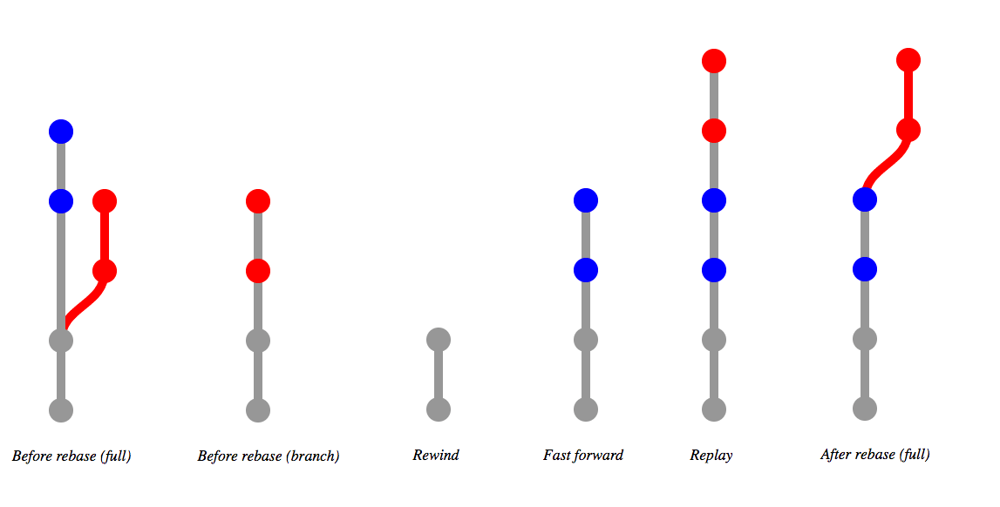

## Branching

Describe branches, how to move the HEAD with checkout and reset, how the 
history diverges, how remote and local branches are synchronized. Use 
graphics to explain the basic concepts, less words.

### Branch navigation

### Rewind

### Fast-forward

### Replay

### Rebase
