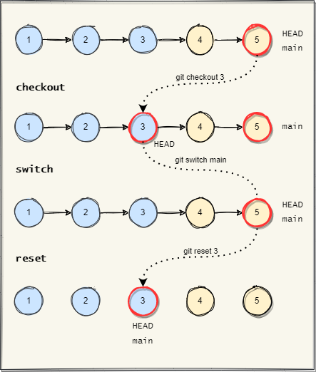

## History navigation

The references model allows git to navigate between branches and commits by 
just replacing the referenced value. Git offers many commands for navigation,
depending on the context. Some of them move the HEAD, others both the branch 
tip and the HEAD. 

