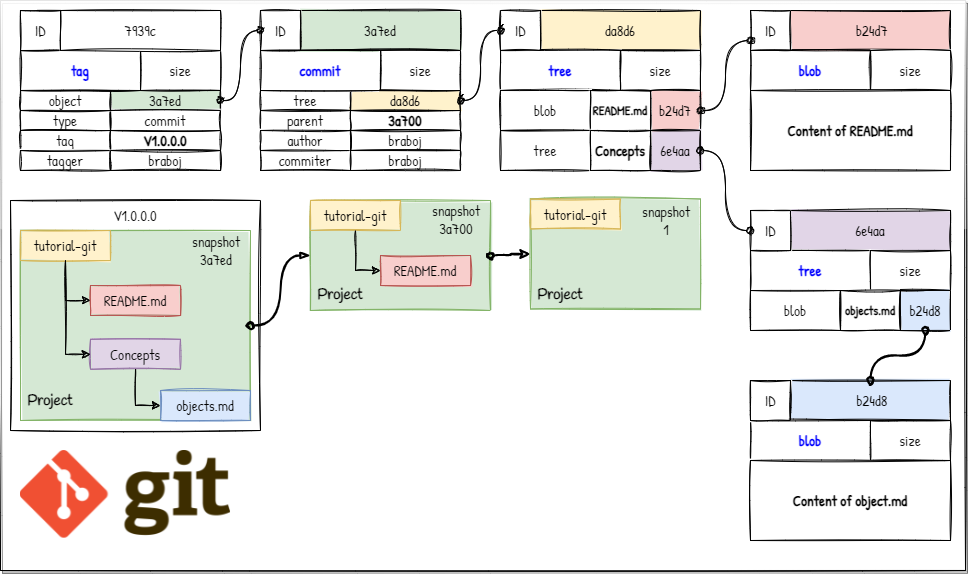

## Object Model



Git is a sytem which allows content to be addressed similar to a book. In a 
book the content is the text on a page and can be referenced by its page number. 
Git offers something similar but instead of pages it uses special 40 digit 
numbers as references. The content and the reference number make the git object.

A hash function is used to generate the 40 digit reference number. Hash 
functions have the special property to transform data sets of any size to 
data sets of a fixed size. A small change in the input data will generate a 
big change in the output data. In the example below the value 
**db79ba36b521373fcfaff3c2e422326a59fe26f6** is also the identification 
code for the commit object. 

```shell
$ git log -1
commit db79ba36b521373fcfaff3c2e422326a59fe26f6 (HEAD -> main, origin/main, origin/HEAD)
Author: Branimir Georgiev <-@->
Date:   Sun Jan 9 20:05:15 2022 +0200
```

-------------------------------------------------------------------------------
### Object storage
Git objects are binary files stored in ***.git/objects***, whose names are 
generated using the hash function [SHA-1](https://en.wikipedia.org/wiki/SHA-1). 
Git takes the first two digits to create a directory and the rest to create 
the object file. 

```
$ tree /f ./git/objects

C:\WORKSPACE\TUTORIAL-GIT\.GIT\OBJECTS
│  
├───db
│       79ba36b521373fcfaff3c2e422326a59fe26f6
│
├───info
└───pack
```

-------------------------------------------------------------------------------
### Tag objects
Annotated tags contain a tag message and some additional information about 
the name of the tag, who created it, the date of the tagging and the object 
the tag refers to. The referenced object can be of any type, including other 
tags. Annotated tags are useful as snapshots for releases.

```shell
$ git cat-file -p mytag

object  3a7ed539ea18da12d5707001d7a4c176f8911240
type    commit
tag     mytag
tagger  braboj <66906831+braboj@users.noreply.github.com> 1641911532 +0200

```

-------------------------------------------------------------------------------
### Commit object
Commit objects store the metadata about a commit, such as the author, the 
date of the commit and references to the parent and all the other changes 
represented by a tree object.

```shell
$ git cat-file -p 3a7ed539ea18da12d5707001d7a4c176f8911240

tree      da8d6f364612a07419ba0baf35dced6b52948c4f
parent    1f8716a405a8c09ef92012e713d3c087ae0b2678
author    braboj <66906831+braboj@users.noreply.github.com> 1641905621 +0200
committer braboj <66906831+braboj@users.noreply.github.com> 1641905621 +0200

(TUT-GIT) - Add banners
```

-------------------------------------------------------------------------------
### Tree object
A collection of references to either child trees or blob objects. Trees in 
git represent directories in the project folder.

```shell
$ git cat-file -p da8d6f364612a07419ba0baf35dced6b52948c4f

100644 blob b24d71e22373e5147f3c05c68a8742714a89b5d6    .gitignore
040000 tree 6e4aac2af494fac5de9b31ec3e522afc62b693b3    01-Introduction
040000 tree 34d3238ab9d7011ea10fd34ed90d0cc00ca1c5a6    02-Concepts
040000 tree 9ccf616a57c67dad449ebe9927006f001644ff5d    03-Operations
040000 tree 027b2a1a3ba3ce6ec61ac9438fb4760962d87919    04-Workflows
040000 tree d998eef3e1ecdfe68401e464ba19024360553830    05-Appendix
040000 tree b2c5547c1334a7462f3bb16f56868bf02ac6f12e    Assets
100644 blob da746af85963471999b5ac8f6826a8bf841c1f7f    CONTRIBUTING.md
100644 blob 4d4e68a8bdc24469d14f9bcff605396eb7de780c    LICENSE.md
040000 tree 84232ef8e0c3532976caadf4ce719847f34cdc95    Playground
100644 blob 676b59c77fb333b04d30b1b66574f08af226d57f    README.md
```

-------------------------------------------------------------------------------
### Blob objects
Binary large objects or BLOBS are compressed files and the end of the tree 
structure. They are the snapshots of a given file after a change has been 
added to the index.

```shell
$ git cat-file -p b24d71e22373e5147f3c05c68a8742714a89b5d6

# These are some examples of commonly ignored file patterns.
# You should customize this list as applicable to your project.
# Learn more about .gitignore:
#     https://www.atlassian.com/git/tutorials/saving-changes/gitignore

```
-------------------------------------------------------------------------------
### Inspecting objects

```shell
# Show object content
$ git cat-file -p db79ba36b521373fcfaff3c2e422326a59fe26f6

# Show object type
$ git cat-file -t db79ba36b521373fcfaff3c2e422326a59fe26f6
```
-------------------------------------------------------------------------------
### Practice

1. Create a git repo
2. Check if the .git folder exists
3. Create a new file
4. Add the file to the index
5. Check if a blob object was created
6. Commit the file
7. Check if a tree and commit objects were created
8. Make a diagram of the object tree
