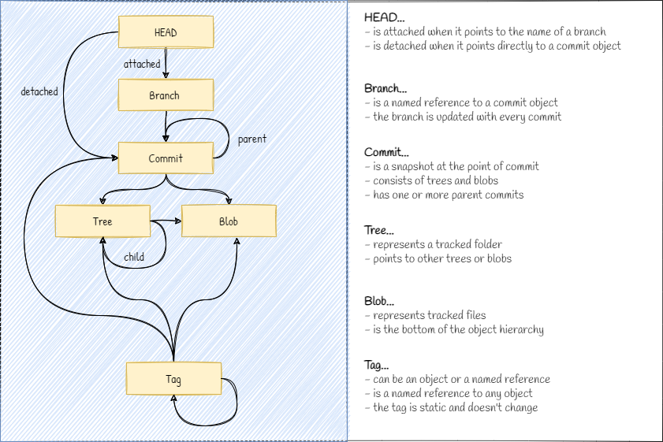

[**Up**](concepts.md) |
[**Content**](../README.md) |
[**Intro**](../01-Introduction/introduction.md) |
[**Concepts**](../02-Concepts/concepts.md) |
[**Operations**](../03-Operations/operations.md) |
[**Dictionary**](../04-Appendix/dictionary.md)

-------------------------------------------------------------------------------
## References

References are files, which store a revision of the referenced object. They 
facilitate git operations by giving the revisions meaningful names. Revisions
are hash values generated by git as unique identifiers. 

```shell
$ cat .git/refs/heads/main
27b210d9280480547540bbe24d397d0420a50dfc
```
-------------------------------------------------------------------------------
### Reference model


-------------------------------------------------------------------------------
### Locations
```
$ tree .git /f          

C:.
│   HEAD                # Current local revision
│
├───heads               # Local branches
│       main            # Tip of the main branch
│
├───remotes             # Remote branches
│   └───origin          # Remote repository 
│           HEAD        # Current remote revision
│           main        # Tip of the origin/main branch
│
└───tags                # Tag references
        V1.0.0.0        # Static reference to a revision
```

-------------------------------------------------------------------------------
### HEAD
This is a file with a reference to the current revision in use. The head can 
point to the tip of a branch (attached) or to a tag or directly to a revision
(detached). 

```shell
# HEAD is attached (points to a tip of a branch)
$ cat .git/HEAD
ref: refs/heads/main

# HEAD is detached (points to a commit object)
$ git checkout 3002ad0adb4c6b24caea57b5f0e4be0b09de89af
$ cat .git/HEAD
$ 3002ad0adb4c6b24caea57b5f0e4be0b09de89af
```

-------------------------------------------------------------------------------
### heads
This folder contains the branch tips. Each branch tip is a file with a reference 
to a commit object inside it. 

```shell
$ cat .git/refs/heads/main
3002ad0adb4c6b24caea57b5f0e4be0b09de89af
```

-------------------------------------------------------------------------------
### remotes
This folder is used to store the tips of the remote branches. The remote repo 
has also a HEAD reference. If the hash value in the file ***origin / main*** 
are is the same as the one in ***main***, then both branches are in sync.

```shell
$ cat .git/refs/remotes/origin/main
3002ad0adb4c6b24caea57b5f0e4be0b09de89af
```

-------------------------------------------------------------------------------
### tags
Tags are static labels for commit objects. Unlike the branches, they don't 
change and are used as snapshots of the project in progress. Tags can point to
any object type including themselves.

```shell
$ cat .git/refs/tags/V1.0.0.0
3002ad0adb4c6b24caea57b5f0e4be0b09de89af
```
