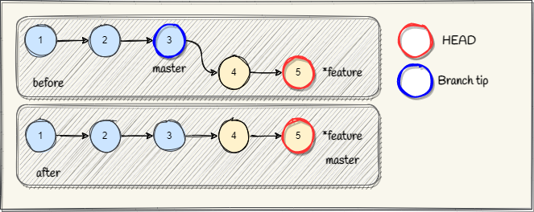
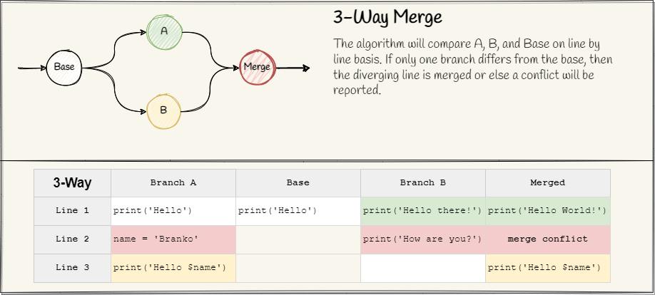
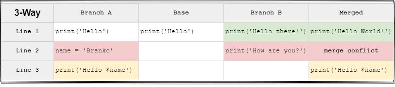

## Merging
Merging is a process of combining changes from different branches. Usually this is 
required when people are working in parallel on the same source code. The file versions in each 
branch are compared and analysed line by line.

-------------------------------------------------------------------------------
### Merge conflicts
Merge conflicts arise when changes are made to the same lines in the source code or when one 
person deletes a file while other persons are editing it. 

-------------------------------------------------------------------------------
### Fast-forward merge strategy
When only one of the branches changes the file, then git will just move the branch tip of the 
target branch to match the latest revision of the file.

-------------------------------------------------------------------------------
### 3-Way merge strategy

When two branches have changes in the same file, then git will analyse the files to determine how 
to combine the differences. The 3-way merge algorithm uses a common ancestor and the two branch 
tips to perform the analysis.

It looks for sections which are the same in only two of the three files. This 
indicates that the change is unique and will be added to the merge result. Sections that are 
different in all three files are marked as a conflict situation and left for the user to resolve.

-------------------------------------------------------------------------------
### Other strategies

 - Recursive 3-Way on two branches
 - Subtree on two branches
 - Octopus on more than two branches
 - Ours on more than two branches

