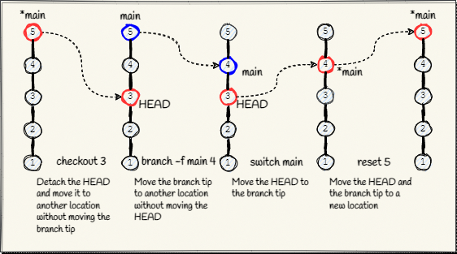

[**Up**](concepts.md) |
[**Content**](../README.md) |
[**Intro**](../01-Introduction/introduction.md) |
[**Concepts**](../02-Concepts/concepts.md) |
[**Operations**](../03-Operations/operations.md) |
[**Dictionary**](../04-Appendix/dictionary.md)
-------------------------------------------------------------------------------

## History navigation

---
### checkout
Checkout will detach the HEAD and move it to a new position. Useful to create
tags or new branches from revisions.

---
### reset
Moves the HEAD and the current branch tip to a new position. Useful to revert
the state of the project.

---
### branch
Creates a new branch or moves the branch to a new position. If the HEAD is
detached then only the branch tip is updated.

---
### switch
Moves the HEAD to a new branch tip.
