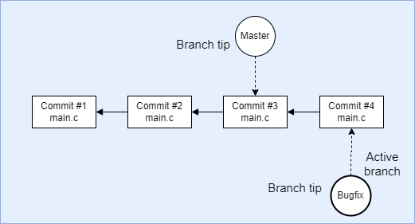
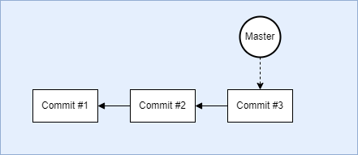
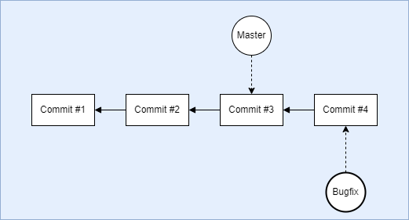
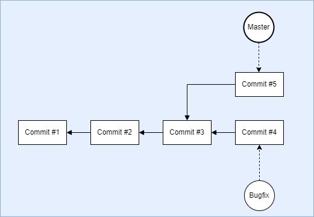
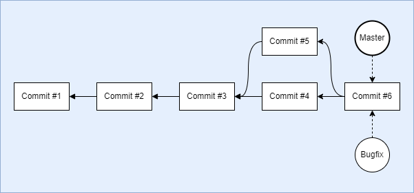

[**Up**](concepts.md) |
[**Content**](../README.md) |
[**Intro**](../01-Introduction/introduction.md) |
[**Concepts**](../02-Concepts/concepts.md) |
[**Operations**](../03-Operations/operations.md) |
[**Dictionary**](../04-Appendix/dictionary.md)

## Branching

### What exactly is a branch in Git ?

 - A branch is a pointer to a specific commit in the revision history.
 - Branches allows parallel work on the same files
 - Branches can be created, merged, renamed and deleted.



-------------------------------------------------------------------------------
### Creating and using branches

To **create a new branch** means that git will **create a refrence to a 
specific commit**. А branch is just a pointer and git doesn't change the 
project history and it doesn't copy any files. This is why branching in git 
is called a 'cheap' operation. With each change the branch will be 
updated to reference the latest commit.

Here is an example workflow for git branches:

- the initial state of the repository looks like this...
    > 
  
- after creating and switching to a new branch the repo changes to...
    > 

- after making a new commit to the new branch the repo changes to...
    > 

- after switching and committing to the main branch the repo changes to...
    > 

- as final the branches are merged and the repo changes to...
    > 
  
-------------------------------------------------------------------------------
### Deleting branches

To **delete a branch** means that git **removes only the named 
reference** to the latest commit in this branch. Git offers 2 commands to 
remove an existing branch...

```
git branch -d <branchName>
```
will delete the branch only after the changes in the branch are merged. And 
the next command...

```
git branch -d -f <branchName>
```
will delete the branch even if there are unmerged commits. In this case the 
commits will be orphaned and will be deleted by git during the next 
cleanup of the repository. The branch can thus be restored within a short 
period of time, depending on count of the orphaned objects.

-------------------------------------------------------------------------------
### Renaming branches

Any existing branch can be renamed using the following command
```
git branch -m <branchName>
```
