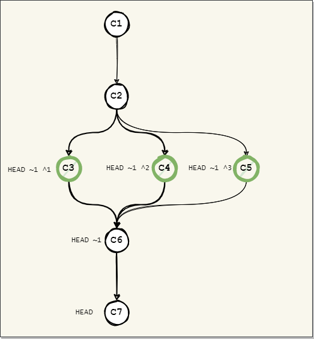
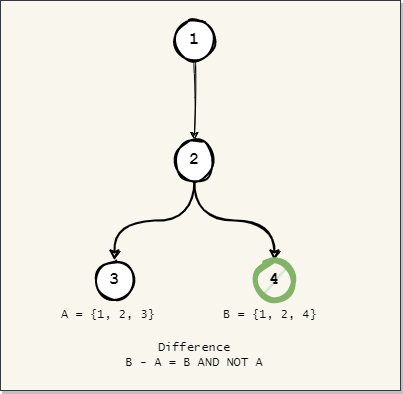
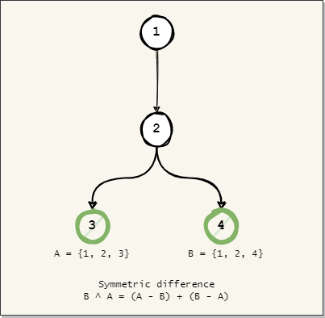
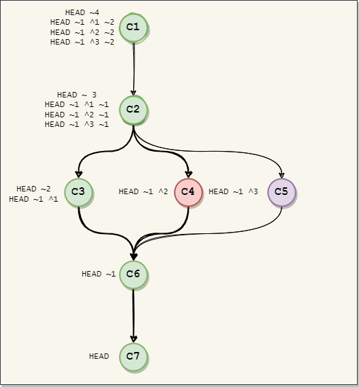

[**Up**](concepts.md) |
[**Content**](../README.md) |
[**Intro**](../01-Introduction/introduction.md) |
[**Concepts**](../02-Concepts/concepts.md) |
[**Operations**](../03-Operations/operations.md) |
[**Dictionary**](../04-Appendix/dictionary.md)

-------------------------------------------------------------------------------
## Revision selectors

Revision selectors (treeish) are special type of operators used to select single or 
multiple revisions from the commit history. The selection can then be used to 
either move the HEAD back in history or in combination with diagnostic tools.

-------------------------------------------------------------------------------
### Ancestry selectors

#### ~
The tilde operator is used to move vertically in a linear commit history. 
This operator follows always the path of the first parent. In the 
diagram below this would be C1, C2, C4, C5 and C6. The other commits from 
the diagram are not accessible using this operator.


#### ^
The caret operator is useful to move horizontally in a non-linear commit 
history. For example in the diagram below C3, C4 and C5 are the parents of 
C6. The commit C3 as first parent can be referenced by ^1, C4 as second 
parent by ^2 and C5 as third parent by ^3. 




-------------------------------------------------------------------------------
### Range selectors

#### ..
The double dot operator is the difference between two sets A and B. If A 
has {1, 2, 3} and B has {1, 2, 4} then the result of the double dot operator 
will be {4}. The double dot operator can be replaced with ^ or --not for 
queries requiring more than 2 branches. 

```shell
$ git log refA..refB          # Reachable from B but not from A
$ git log refB ^refA          # Reachable from B but not from A
$ git log refB --not refA     # Reachable from B but not from A
```



#### ...
The triple dot operator is the symmetric difference between two sets A and B.
If A has {1, 2, 3} and B has {2, 3, 4} then the result of the triple dot 
operator will be {1, 4}. The symmetric difference returns elements unique to 
each set.

```shell
git log --left-right main...test
```


-------------------------------------------------------------------------------
### Reflog selectors
The @ operator is used to browse the local reflog history relative to a 
well-defined reference such as HEAD or a branch.

- 1.minute.ago
- 1.hour.ago
- 1.day.ago or yesterday
- 1.week.ago
- 1.month.ago
- 1.year.ago

```shell

# Show all reflogs starting from entry #1
$ git log "main@{now}"

# Show all reflogs starting from entry #1
$ git log "HEAD@{1}"

# Show all reflogs starting from yesterday

$ git log "HEAD@{yesterday}"

# Show all reflogs starting from 2 months ago
$ git log "HEAD@{2.months.ago}"
```

-------------------------------------------------------------------------------
### Practice


