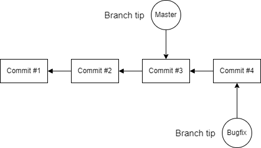

## Branching

### What exactly is a branch in Git ?

**Branch** is a pointer to a specific commit (point) in your code.

Branches can be created, renamed and deleted.



-------------------------------------------------------------------------------
### Create Branch

Create new **branch** means that git create a new pointer to the specific commit.
That means that creating branches doesn't change any thing in your repository.

- after creating a new branch our repository looks like
    > 

- after making a new commit to our new branch our repository looks like
    > 

- if we make changes to main branch our repository will look like
    > 

-------------------------------------------------------------------------------
### Delete Branch

Delete an existing **branch** means that git removes this pointer, if this branch has unmerged commits we will lost all of them.

Git has 2 commands to delete an existing branch

```
git branch -d <branchName>
```
this command only delete the branch if there is no unmerged commits.


```
git branch -D <branchName>
```
this command delete the branch anyway even there is unmerged commits.

-------------------------------------------------------------------------------
### Rename Branch

Git enables us to rename any existing branch using the following command
```
git branch -m <branchName>
```