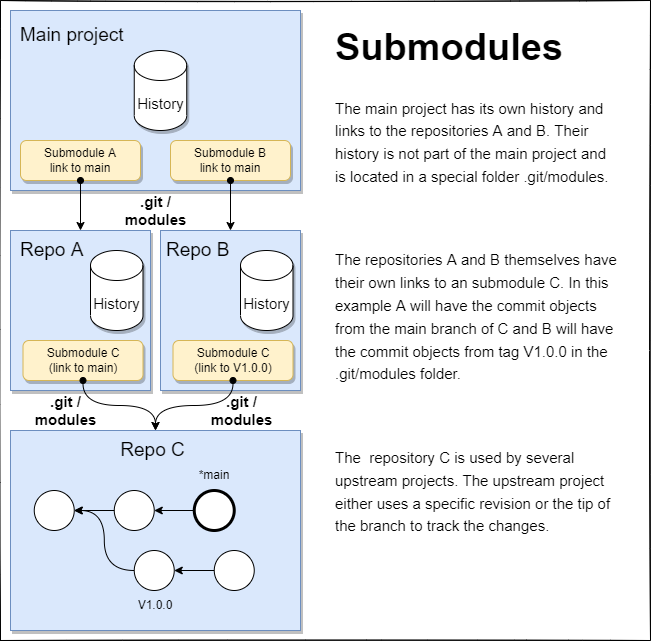
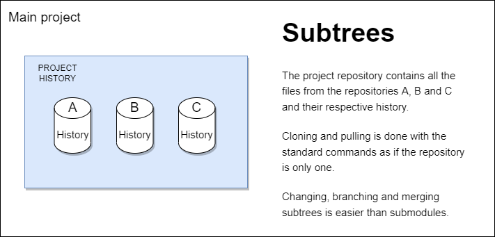

[**Up**](concepts.md) |
[**Content**](../README.md) |
[**Intro**](../01-Introduction/introduction.md) |
[**Concepts**](../02-Concepts/concepts.md) |
[**Operations**](../03-Operations/operations.md) |
[**Dictionary**](../04-Appendix/dictionary.md)

## Reusing code

Very often a source code has to be **reused** in many projects. Code 
which is reused is also called a **module**, a **library**, a **framework**, 
or a **package**. It is not feasible to copy the code each time, as 
each copy must be maintained manually. It is much easier to have a central 
repository with the reused code and let git automate the copying and 
synchronization of the files. Git offers two popular solutions for 
this: **submodule** and **subtree**.

-------------------------------------------------------------------------------
### Submodules

- A small footprint size
- A submodule is a **reference to a specific commit** of another repository
- A submodule **must be updated manually** with submodule commands
- A submodule **links a branch or a specific revision**
- A repository can have **more than one** submodule
- Submodules can be **nested**

> 

#### Why submodules?
- Submodules are native to git
- Submodule repositories have their own commit history
- A new submodule version can be released without affecting the project
- A checkout to a different revision of the submodule doesn't affect the project
- Usually used for bigger project where checkout times can be significant

#### Submodules drawbacks
- No automatic updates for the submodule
- Use of additional set of commands to handle submodules
- Nested submodules are omitted by default
- Merging changes from the project into the submodules are difficult

See also: [git submodule](../03-Operations/09-Reuse/01-git-submodule.md)

-------------------------------------------------------------------------------
### Subtrees

- A transparent view of the code base
- A subtree is a **full copy of another repository** with files and history
- A subtree can be handled **using standard commands**
- A repository can have **more than one subtree**
- Subtrees are **not nested**

> 

#### Why subtrees?
- A subtree can be updated using standard commands (clone or pull)
- A subtree is easier to use for branching and merging
- A subtree doesn't add metadata files
- Older version of git are supported (even before v1.5.2)
- Usually used for integrated projects with frequent commits

#### Subtree drawbacks
- Subtree is a tool and not native to git
- Subtrees require a deeper understanding of git merging strategies
- Special attention of not mixing project and subtree code in commits
- A checkout to a different revision will affect all the project files
- Not recommended when the amount of dependencies is too large.

See also: [git subtree](../03-Operations/09-Reuse/02-git-subtree.md)

-------------------------------------------------------------------------------
### Which to use?

> **Git submodules** is more fit to a ***component-based development*** where 
> the project depends on a specific version (commit) of an external 
> repository and the user doesn't change the code of the submodule or the 
> submodule doesn't change frequently.

> **Git subtrees** is more fit to a ***system-based development*** where the 
> user wants to have a full copy all files and their history and the 
> subtree will be changed frequently either by the maintainer or by the 
> user himself.

-------------------------------------------------------------------------------
### Other tools

- [google repo](https://gerrit.googlesource.com/git-repo/)
- [git subrepo](https://github.com/ingydotnet/git-subrepo#readme)
- [git slave](https://sourceforge.net/p/gitslave/code/ci/master/tree)