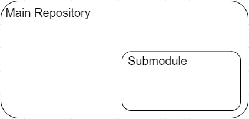
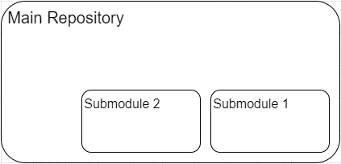

[**Up**](concepts.md) |
[**Content**](../README.md) |
[**Intro**](../01-Introduction/introduction.md) |
[**Concepts**](../02-Concepts/concepts.md) |
[**Operations**](../03-Operations/operations.md) |
[**Dictionary**](../04-Appendix/dictionary.md)

## Integration of external repositories

-------------------------------------------------------------------------------
### Submodules

- This concept allows you to clone a repository in another repository
- **Submodule** is a reference to a specific commit (Manually updated) in another repository
- Having a **submodule** is like install an external package in your project using NPM, Ruby Gems or any other package manager

> NOTE: It is better to omit manually updated because it requires implicit 
> knowledge of how it works.

> 

- A repository can have more than one submodule, Like more than one child repository for one parent repository.

> 

> NOTE: Only one picture is enough if no dynamic is involved.

#### Why submodules !!
- Separate code into different independent repositories
    > independent repositories mean that every repository has its own commits history and we can release new version of any repository without affect the other one
- Share submodule with multiple repositories

#### Submodules drawbacks
- Use different set of commands
- No automatic updates for the submodule
- Submodules over use may made your project complex
- You should be careful when you clone a repository that has submodules

-------------------------------------------------------------------------------
### Subtrees

- **Subtrees** is an alternative way to have a child repository in another parent repository
- **Subtrees** put the entire child repository along with its commit history in the parent repository

-------------------------------------------------------------------------------
### Which to use ?

> **Git submodules** is more fit to *component-based development* where your project depend on a specific version (commit) of an external repository

> **Git subtrees** is more fit to *system-based development* that your repository contain a full copy all files (Not just a reference) and you can access and modify any part
