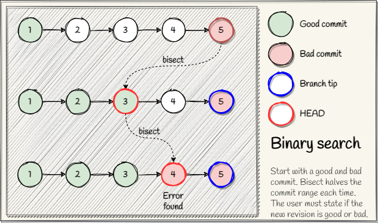

## git bisect
Find a bug using binary search. The command will detach the HEAD and move it to a revision in 
the middle between a specified good and bad commit. The user is always required to update if the 
bisection is good or bad to narrow down the results. The algorithm stops when only one 
revision left after the bisection.



-------------------------------------------------------------------------------
### Examples
```shell
* a8c2f4e 2022-01-14 | bad (HEAD -> master) [braboj]
* e04b8f5 2022-01-14 | bad [braboj]
* 8b5ce19 2022-01-14 | good [braboj]
* a0f2e3d 2022-01-14 | good [braboj]
* 34a2157 2022-01-14 | good [braboj]

# Start binary search
$ git bisect start

# First bad commit
$ git bisect bad HEAD

# First good commit
$ git bisect good 34a21
Bisecting: 1 revision left to test after this (roughly 1 step)
[8b5ce1918f88613614d0dfea8509446777ecf6cb] 3

# Mark as good
$ git bisect good
Bisecting: 0 revisions left to test after this (roughly 0 steps)
[e04b8f53e471070089dc9c6b652e72b154fe4be9] 5

# Mark as bad
$ git bisect bad
e04b8f53e471070089dc9c6b652e72b154fe4be9 is the first bad commit
commit e04b8f53e471070089dc9c6b652e72b154fe4be9
Author: braboj <66906831+braboj@users.noreply.github.com>
Date:   Fri Jan 14 10:51:51 2022 +0200

    bad

# Stop binary search
$ git bisect reset 
```
