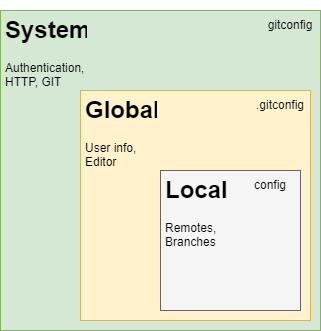

## Configuration Model



### Local configuration

The ***local configuration*** file is placed in the .git folder under the name
***config***. The local configuration file is used to manage the parameters
of this repository only.

```
PS C:\Workspace\project\.git> type config
[core]
        repositoryformatversion = 0
        filemode = false
        bare = false
        logallrefupdates = true
        symlinks = false
        ignorecase = true
[remote "origin"]
        url = C:/Workspace/Tutorials/tutorial-git/Playground/project.git
        fetch = +refs/heads/*:refs/remotes/origin/*
[branch "master"]
        remote = origin
        merge = refs/heads/master

```

### Global configuration
The location of the ***global configuration*** file vary depending on the
operating system used. The name of the file is ***.gitconfig***. Under Windows
the file is placed in ***C:\users\\<username\>***.

```
PS C:\users\luke> type .\.gitconfig
[filter "lfs"]
        clean = git-lfs clean -- %f
        smudge = git-lfs smudge -- %f
        process = git-lfs filter-process
        required = true
[user]
        name = Luke Skywalker
        email = luke@gmail.com
[core]
        longpaths = true
        autocrlf = true
        excludesfile = C:\\Users\\luke\\Documents\\gitignore_global.txt

```

### System configuration
The ***system configuration*** file also depends on the operating system 
used. Its name is ***gitconfig*** and under Windows it is to be found in the 
installation folder of git.

``` 
PS C:\Program Files\Git\etc\type gitconfig
 
[diff "astextplain"]
	textconv = astextplain
[filter "lfs"]
	clean = git-lfs clean -- %f
	smudge = git-lfs smudge -- %f
	process = git-lfs filter-process
	required = true
[http]
	sslBackend = openssl
	sslCAInfo = C:/Program Files/Git/mingw64/ssl/certs/ca-bundle.crt
[core]
	autocrlf = true
	fscache = true
	symlinks = false
	editor = \"C:\\\\Program Files (x86)\\\\Notepad++\\\\notepad++.exe\" -multiInst -notabbar -nosession -noPlugin
[pull]
	rebase = false
[credential]
	helper = manager-core
[credential "https://dev.azure.com"]
	useHttpPath = true
[init]
	defaultBranch = master
```

### Practice
1. Configure the username and email globally
2. Configure the editor globally
3. Configure the 

### References
- <https://git-scm.com/docs/git-config>