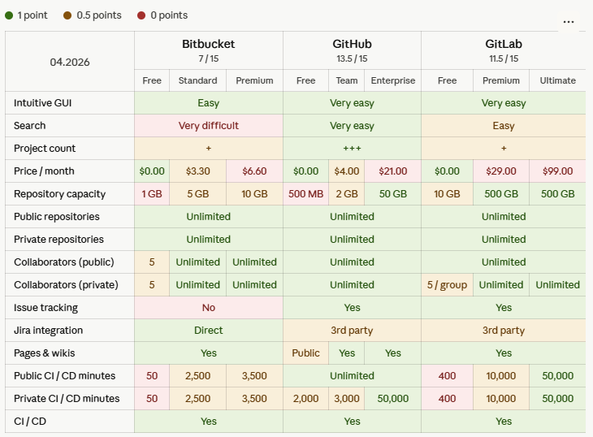
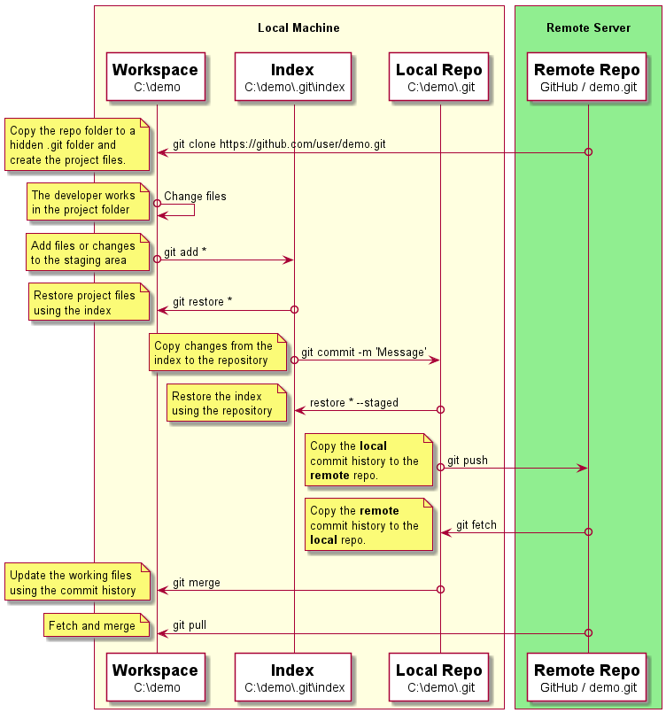
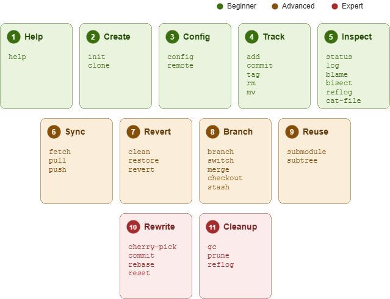

## Overview

Git is a version control system. It keeps a complete history of every change
you make to your files, so you can go back to any earlier version at any time.
Think of it as an unlimited undo button for your entire project.

Why use version control?

- Your work is protected against accidental deletion or hardware failure
- Every change is recorded — you can see who changed what, and when
- You can review changes before saving them permanently
- Multiple people can work on the same project without overwriting each other
- You can experiment on a separate branch and merge it back when it works

## Features

Git is **open source** and free to use. Unlike older systems such as
Subversion (SVN) where all history lives on a central server, Git is
**distributed** — everyone working on a project has a full copy on their
own machine. This means you can work offline, save changes locally, and
share with others when you are ready.

- **Open source** — free, community-maintained, runs on every major platform
- **Distributed** — every copy contains the complete project and its full history
- **Branching** — work on separate ideas at the same time without interfering with each other
- **Fast** — most operations happen on your own machine, with no waiting for a server

## Install on Windows

1. Browse to the official Git website: https://git-scm.com/downloads
2. Click the download link for Windows and allow the download to complete.
3. Browse to the download location
4. Double-click the file to launch the installer.
5. Follow the installation steps with the default options
6. Open PowerShell after the installation
7. Type `git --version` to test the installation

## Install on macOS

Git ships with the Xcode Command Line Tools. If you prefer a standalone
install, use Homebrew.

**Option A — Xcode Command Line Tools (no extra software needed):**

1. Open Terminal
2. Type `git --version`
3. If Git is not installed, macOS will prompt you to install the Command Line Tools — follow the dialog

**Option B — Homebrew:**

1. Install [Homebrew](https://brew.sh/) if you do not have it
2. Run `brew install git`
3. Type `git --version` to test the installation

## Install on Linux

| Distribution    | Command                              |
|-----------------|--------------------------------------|
| Ubuntu / Debian | `apt-get install git`                |
| Fedora 22+      | `dnf install git`                    |
| Arch Linux      | `pacman -S git`                      |
| openSUSE        | `zypper install git`                 |
| Alpine          | `apk add git`                        |
| Gentoo          | `emerge --ask --verbose dev-vcs/git` |
| FreeBSD         | `pkg install git`                    |
| Nix/NixOS       | `nix-env -i git`                     |

## Hosting

A Git hosting service stores your repositories online so you can access them
from anywhere and collaborate with others. You do not need your own server —
the hosting provider handles storage, backups and access control.

### Main providers

- [GitHub](https://github.com/) — largest community, default for open source
- [GitLab](https://about.gitlab.com/) — built-in automation for testing and deployment, can be self-hosted
- [Bitbucket](https://bitbucket.org/) — integrates with Jira and other Atlassian tools

All three offer free plans for individuals and small teams.

### Competitive Matrix

The table below compares the free tiers of each provider.



## How Git Works

Git moves your changes through three locations before they are shared
with others. The diagram below shows these locations and the commands
that transfer data between them.



### Workspace

The workspace (also called *worktree*) is the project folder on your
computer. This is where you create, edit and delete files. Changes here
are not yet tracked by Git — they exist only on your hard drive.

### Index

The index (also called the *staging area*) is a holding area where you
prepare the next commit. You pick which changes to include by adding
them to the index with `git add`. This lets you commit related changes
together, even if you modified many files.

### Repository

The repository stores the full history of your project as a series of
snapshots called *commits*. Each commit records exactly what the project
looked like at that moment. The repository can be **local** (on your
machine) or **remote** (on a hosting service like GitHub). Git treats
both as equals — there is no single authoritative copy. (The word "master"
here means primary, not the branch name `master` — Git uses `main` as the
default branch name.)

### How a commit works

When you run `git commit`, Git takes a snapshot of everything in the index
and stores it permanently in the repository. Each snapshot is called a
*commit* and gets a unique identifier called a *hash* — a long string of
letters and numbers that acts like a fingerprint for that snapshot. Every
commit also records who made it, when, and a short message describing
what changed.

Each commit points back to the one before it, forming a chain. This chain
is the history of your project — you can follow it backwards to see exactly
how the project evolved, one commit at a time.

```
A ← B ← C ← D   (main)
         ↑
    each commit points to its parent
```

In the diagram above, `D` is the latest commit. It points back to `C`,
which points to `B`, and so on. Git follows these links to reconstruct the
full history.

## Command Overview



Commands are grouped by experience level:

- **Beginner** — Help, Create, Configure, Track, Branch
- **Advanced** — Sync, Revert, Inspect, Reuse
- **Expert** — Rewrite and Cleanup (can destroy history — use with caution)

### Help

Look up documentation for any command, guide or configuration option.

```shell
$ git help commit
```

### Create

Start a new project from scratch or copy an existing one from a server.

```shell
$ git init
$ git clone https://github.com/user/demo.git
```

### Configure

Set your identity and create shortcuts for common commands.

```shell
$ git config --global user.email "user@mail.com"
$ git config --global alias.hist "log --oneline --graph"
```

### Track

Add your changes to the next save point, save them, and label important
versions with a tag.

```shell
$ git add README.md
$ git commit -m "Initial commit"
$ git tag v1.0
```

> **Tip:** Create a `.gitignore` file to tell Git which files to skip —
> build output, editor settings, credentials, and other files that should
> not be tracked. Git will ignore them automatically.

### Branch

Work on features in isolation, then integrate them back. Use stash to
set aside uncommitted changes temporarily.

```shell
$ git branch feature
$ git switch feature
$ git switch main
$ git merge feature
```

> **Note:** Older tutorials and documentation use `git checkout` instead
> of `git switch`. Both work, but `switch` (added in Git 2.23) is the
> recommended command for changing branches.

### Sync

Share your work with others by pushing to and pulling from a remote repository.

```shell
$ git push origin main
$ git pull origin main
```

### Revert

Undo changes at different levels — discard edits you have not saved yet,
remove files from the staging area, or reverse an entire commit.

```shell
$ git restore README.md
$ git restore --staged README.md
$ git revert HEAD
```

### Inspect

Examine the commit history, check repository status, and compare changes.

```shell
$ git status
$ git log --oneline
$ git diff
```

### Reuse

Include external repositories inside your project as submodules.

```shell
$ git submodule add https://github.com/user/lib.git
$ git submodule update --init
```

## Exercises

Hands-on exercises for the Introduction section. Use the reference pages
in this chapter if you get stuck. Do not skip the verification steps.

### Exercise 1: Verify Your Git Installation

**Task:** Confirm that Git is installed and check which version you are running.

**Steps:**

1. Open a terminal (PowerShell on Windows, Terminal.app on macOS, or a shell on Linux)
2. Run the command to display the installed Git version
3. Run the command to display the built-in help overview

**Verify:**

The version command prints a line starting with `git version` followed by
a version number. The help command prints a list of common Git commands grouped
by category.

---

### Exercise 2: Configure Your Identity

**Task:** Set up the user name and email that Git will attach to every commit
you make.

**Steps:**

1. Set your global user name using `git config`
2. Set your global email address using `git config`
3. Read back both values to confirm they are stored correctly
4. Display the full list of configuration settings with `git config --list`

**Verify:**

The read-back commands print exactly the name and email you entered.
Both entries also appear in the `--list` output.

---

### Exercise 3: Create a Local Repository

**Task:** Initialise a brand-new local Git repository and make your first commit.

**Steps:**

1. Create a new directory called `git-exercises` and enter it
2. Initialise a Git repository inside the directory
3. Create a file called `hello.txt` with some text in it
4. Check the status of the working tree
5. Add the file to the staging area (index)
6. Check the status again to see the file is staged
7. Commit the staged file with the message `Add hello.txt`

**Verify:**

Running `git log` shows one commit with the message `Add hello.txt`.
Running `git status` reports a clean working tree with nothing to commit.

---

### Exercise 4: Track a Change Through the Pipeline

**Task:** Walk a change through all three locations — workspace, index
and repository — to see how Git tracks it at each step.

**Steps:**

1. Inside the `git-exercises` repository, edit `hello.txt` and add a second line
2. Run `git status` to see the file listed as modified (workspace)
3. Run `git diff` to see the exact change
4. Add the file to the index with `git add`
5. Run `git status` again to see the file listed as staged (index)
6. Run `git diff --staged` to see what will be committed
7. Commit the change with a descriptive message
8. Run `git log` to confirm the new commit appears in the local repository

**Verify:**

`git status` reports a clean working tree. `git log` shows two commits
in chronological order.

---

### Exercise 5: Inspect the Repository

**Task:** Use several commands to look at the commit history and
understand what Git recorded.

**Steps:**

1. Run `git log` to see the full commit history
2. Run `git log --oneline` to see a compact, one-line-per-commit view
3. Run `git show` to see the details of the latest commit — who made it,
   when, the commit message, and exactly what changed
4. Run `git status` to confirm there is nothing left to commit

**Verify:**

`git log` shows two commits in order. `git show` displays the author,
date, message and a summary of changes for the most recent commit.
`git status` reports a clean working tree.

---

### Exercise 6: Connect to a Remote Repository

**Task:** Create a repository on a hosting service, link it to your local
repository, and push your commits.

**Steps:**

1. Sign in to GitHub (or another hosting service from the reference page)
2. Create a new empty repository named `git-exercises` — do not add a README
   or any other files
3. Copy the HTTPS URL of the new repository (you can also use SSH —
   HTTPS is simpler to start with; SSH is covered in later chapters)
4. In your local `git-exercises` repository, add the remote with
   `git remote add origin <url>`
5. Run `git remote -v` to confirm the remote is registered
6. Push the local commits to the remote with `git push -u origin main`
7. Refresh the repository page in the browser

**Verify:**

The hosting service shows all committed files and the full commit
history matches what `git log` displays locally. Running `git branch -av`
shows both the local and remote branch pointing to the same commit.

## Quiz

Test your understanding of the concepts covered in this chapter.

**Q1.** What are the three locations that Git moves changes through before
they are shared with others?

- A) Workspace, Index, Repository
- B) Editor, Terminal, Server
- C) Branch, Commit, Push
- D) Local, Cloud, Backup

**Q2.** What does `git commit` actually save?

- A) Every file in the workspace
- B) A snapshot of everything in the index
- C) Only the files that changed since the last commit
- D) A copy of the remote repository

**Q3.** What makes Git different from centralised systems like SVN?

- A) Git requires an internet connection at all times
- B) Git only stores the latest version of each file
- C) Every copy contains the complete project and its full history
- D) Git does not support branching

**Q4.** What is a commit hash?

- A) A password that protects the commit
- B) A short description of the change
- C) A unique identifier that acts like a fingerprint for a snapshot
- D) The name of the branch the commit belongs to

**Q5.** Which command should you use to change branches in Git 2.23+?

- A) `git checkout`
- B) `git branch`
- C) `git switch`
- D) `git merge`

**Q6.** What is the purpose of a `.gitignore` file?

- A) To delete files from the repository
- B) To tell Git which files to skip and not track
- C) To hide commits from the log
- D) To prevent other users from cloning the repository

### Answers

1. A — Workspace, Index, Repository
2. B — A snapshot of everything in the index
3. C — Every copy contains the complete project and its full history
4. C — A unique identifier that acts like a fingerprint for a snapshot
5. C — `git switch`
6. B — To tell Git which files to skip and not track
