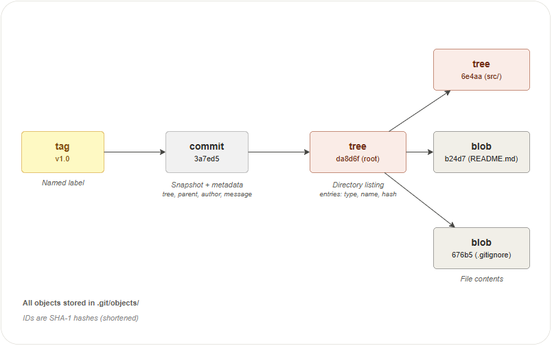

## 1. Overview

This chapter covers the internal building blocks of Git — how repositories
are structured, how Git stores data as objects, and how references connect
everything together. Understanding these internals will help you make sense
of what Git commands actually do under the hood.

In this chapter you will learn:

- The difference between bare and non-bare repositories
- How Git's object model stores files, directories, commits, and tags
- How the index (staging area) prepares changes for commits
- How references and HEAD connect names to commits
- How to navigate and rewrite history with reset

## 2. Repository

A repository is a database that stores the complete history of a project
as a series of snapshots (commits). Every commit records exactly what
every tracked file looked like at that moment — Git stores full snapshots,
not differences between versions.

The repository lives inside a hidden folder called `.git`. This folder
**is** the repository — it contains all objects (files, directories,
commits), all references (branches, tags), and the project configuration.
Everything outside `.git` is the **working tree** — the files you edit
directly.

A repository can be **local** (on your machine) or **remote** (on a
server like GitHub). Git treats both as equals — you can push to and
pull from any repository you have access to.

Git supports two repository layouts:

### Bare Repository

A **bare repository** is a Git repository without a working tree — it
contains only the `.git` internals (objects, refs, config) and no
checked-out files. Hosting services like GitHub and GitLab store repositories as bare
on the server. When you edit a file through GitHub's web interface,
GitHub creates a commit directly — it does not use a working tree.

> **Note:** "bare" and "remote" are not the same thing. A remote is any
> repository you connect to via URL. Remotes are *usually* bare, but a
> remote can also be a regular repository on another machine.

```text
git init --bare project.git

PROJECT.GIT/
├───hooks       # Scripts that run on events (pre-commit, post-merge, etc.)
├───info        # Repository metadata (exclude patterns, etc.)
├───objects     # All Git objects (blobs, trees, commits, tags)
│   ├───info    # Object storage metadata
│   └───pack    # Compressed object packs for efficiency
└───refs        # Named references to commits
    ├───heads   # Branch tips
    └───tags    # Tag references
```

### Non-bare Repository

A **non-bare repository** (also called a regular or working repository)
is what you get when you clone or run `git init`. It has a working tree
where you create, edit and delete files, plus a hidden `.git` folder
that stores the full history and configuration.

```text
git clone project.git

PROJECT/
│   readme.md                # Working tree — your editable files
└───.git                     # Repository internals (same as bare)
    ├───hooks                # Event scripts
    ├───info                 # Repository metadata
    ├───objects              # All Git objects
    │   ├───info             # Object storage metadata
    │   └───pack             # Compressed object packs
    └───refs                 # Named references
        ├───heads            # Branch tips
        └───tags             # Tag references
```

The `.git` folder contains the same structure as a bare repository.
The difference is that a non-bare repository also has a working tree
next to it — the place where you do your actual work.

## 3. Object Model

Every time you commit, Git takes a **snapshot** — a complete picture of
every tracked file in your project at that moment. A snapshot is not a
list of what changed since the last commit; it is a full record of what
every file looks like right now. If a file has not changed, Git does not
store a new copy — it reuses the existing one. This makes snapshots
efficient despite recording the entire project each time.

Git stores these snapshots — along with files, directories, and labels —
as **objects**. There are four object types, and every object in Git is
one of these:

| Type | Stores | Analogy |
|------|--------|---------|
| Blob | The contents of a single file | A page in a notebook |
| Tree | A directory listing (references to blobs and other trees) | A table of contents |
| Commit | A snapshot of the project (references a tree) + metadata | A dated entry in a logbook |
| Tag | A named label (references a commit) + metadata | A sticky note on a logbook entry |

### Blob Object

A blob (**b**inary **l**arge **ob**ject) stores the contents of a single
file — the actual text or binary data inside it. It contains only the
raw data — no file name, no path, no permissions. Two files with
identical content share the same blob, even if they have different names.

```text
$ git cat-file -p b24d71e
# Git Tutorial

Welcome to the Git tutorial. This guide covers the fundamentals
of version control with Git.
```

A blob is created when you run `git add`. Git compresses the file
contents (makes them smaller for storage), computes a hash (a unique
identifier — explained below), and stores the result as an object.

### Tree Object

A tree represents a directory (folder). It contains a list of entries,
where each entry is a reference to either a blob (file) or another tree
(subfolder), along with the file name and permissions (who is allowed
to read, write, or execute the file).

```text
$ git cat-file -p da8d6f3
100644 blob b24d71e...    .gitignore
040000 tree 6e4aac2...    src/
040000 tree 34d3238...    docs/
100644 blob 676b59c...    README.md
```

Each entry starts with a **mode** that encodes the file type and
permissions:

| Mode | Meaning |
|------|---------|
| `100644` | Regular file — most files you create will have this mode |
| `100755` | Executable file — a program or script that can be run directly |
| `040000` | Subdirectory — points to another tree object |
| `120000` | Symbolic link — a special file that contains a path to another file; opening it opens the target instead |
| `160000` | Submodule — a reference to a commit in another Git repository |

Together, the tree objects form a hierarchy that mirrors your project's
folder structure at a specific point in time.

### Commit Object

A commit records a snapshot of the entire project at a specific moment.
It references a single root tree (the top-level directory of the project)
and stores metadata — extra information about the change: who made it
(author), when (timestamp), and a short message describing why.

```text
$ git cat-file -p 3a7ed53
tree      da8d6f364612a07419ba0baf35dced6b52948c4f
parent    1f8716a405a8c09ef92012e713d3c087ae0b2678
author    user <user@example.com> 1641905621 +0200
committer user <user@example.com> 1641905621 +0200

Add project documentation
```

Every commit (except the very first one) has a **parent** — the commit
that came before it. This parent reference forms a chain that is the
history of your project. Merge commits have two or more parents.

### Tag Object (Labels)

A tag object points to a commit and records extra information: who
created the tag, when, and a message explaining what it represents.
Tags are used to mark important points in the project history, most
commonly release versions (e.g. `v1.0`, `v2.0`).

Because tag objects carry this extra information, they are called
**annotated tags** — the annotation is the metadata that makes them
more than just a name.

```text
$ git cat-file -p v1.0
object  3a7ed539ea18da12d5707001d7a4c176f8911240
type    commit
tag     v1.0
tagger  user <user@example.com> 1641911532 +0200

First stable release
```

Unlike branches, tags do not move — they always point to the same
commit. Use annotated tags for anything you plan to share with others.
Tags are **not** pushed automatically — you must run
`git push origin --tags` or `git push origin v1.0` explicitly.

> **Note:** Git also supports **lightweight tags**, which are not
> objects. A lightweight tag is just a plain file in `.git/refs/tags/`
> containing a commit hash — no author, no date, no message. They are
> quick to create but carry no information about who created them or
> why. Use lightweight tags for temporary local bookmarks only.

### How Objects Relate

The diagram below shows how the four object types connect. A tag
points to a commit, a commit points to a root tree, and a tree
contains blobs (files) and other trees (subdirectories). All objects
are immutable and stored in `.git/objects/`.



Here is a concrete example showing two commits with their trees and
blobs. Each commit is a full snapshot — commit N has four files,
commit M has two:

```
  tag "v1.0"
      │
      ▼
  commit N ──parent──▶ commit M ──▶ ...
      │                    │
      ▼                    ▼
  tree (root)          tree (root)
   ├── blob  README.md  ├── blob  README.md
   ├── tree  src/       └── blob  .gitignore
   │    └── blob  main.py
   └── blob  .gitignore
```

Following these references from any commit, Git can reconstruct the
exact state of every file at that point in time.

### How Objects Are Identified

Every object gets a unique 40-character identifier called a **hash**.
Think of it like a fingerprint — just as no two people have the same
fingerprint, no two different pieces of content produce the same hash.

Git computes the hash using an algorithm called
[SHA-1](https://en.wikipedia.org/wiki/SHA-1). The algorithm takes the
object's content as input and produces a fixed-length string of letters
and numbers. The same content always produces the same hash. If even one
character changes, the hash changes completely.

```text
$ git log -1
commit db79ba36b521373fcfaff3c2e422326a59fe26f6 (HEAD -> main)
Author: Your Name <your.email@example.com>
Date:   Sun Jan 9 20:05:15 2022 +0200
```

The value `db79ba36b521373fcfaff3c2e422326a59fe26f6` is the hash of this
commit object. In practice, you only need the first 7–8 characters
(e.g. `db79ba3`) — Git will resolve the full hash automatically.

### How Objects Are Stored

Git stores objects as compressed files in `.git/objects/`. To avoid
putting thousands of files in a single folder, Git uses the first two
characters of the hash as a subfolder name and the remaining 38
characters as the file name.

For example, an object with the hash `3a7ed539ea18da12d5707001d7a4c176f8911240`
is stored in a folder named `3a` with a file named after the remaining
38 characters:

```text
$ ls .git/objects/3a/

.git/objects/
│
├───3a/                                        ← first 2 characters of the hash
│       7ed539ea18da12d5707001d7a4c176f8911240  ← remaining 38 characters
│       f20b1c84e9a7d3561e0c42f890abcde1234567  ← another object starting with 3a
│       01cc9d8b7e6f5432a1b0c9d8e7f6a5b4c3d2e1  ← and another
│
├───info/
└───pack/
```

Every object whose hash starts with the same two characters ends up in
the same folder. Git splits objects across 256 possible folders (`00`
to `ff`) to keep each folder manageable.

As a repository grows further, Git compresses multiple objects into a
single file in the `pack/` directory for efficiency.

### Inspecting Objects

You will rarely need to inspect objects directly, but it is useful for
understanding how Git works under the hood or for debugging unexpected
behaviour. The `git cat-file` command lets you examine any object by
its hash (you only need the first 7–8 characters):

```text
$ git cat-file -t 3a7ed53        # what type of object is this?
commit

$ git cat-file -s 3a7ed53        # how large is this object?
231

$ git cat-file -p 3a7ed53        # show the full content
tree      da8d6f364612a07419ba0baf35dced6b52948c4f
parent    1f8716a405a8c09ef92012e713d3c087ae0b2678
author    user <user@example.com> 1641905621 +0200
committer user <user@example.com> 1641905621 +0200

Add project documentation
```

| Flag | Shows | Example output |
|------|-------|----------------|
| `-t` | Object type | `commit`, `tree`, `blob`, or `tag` |
| `-s` | Object size in bytes | `231` |
| `-p` | Object content (pretty-print) | Depends on the type — see examples above |

## 4. Index (Staging Area)

The index is the area between your working tree and the repository. It
holds a list of changes that are ready to be included in the next
commit. In chapter 01 we called this the *staging area* — the index is
the internal name for the same thing.

When you edit a file, the change exists only in your working tree. When
you run `git add`, Git copies the change into the index. When you run
`git commit`, Git takes everything in the index and saves it as a new
commit. This two-step process lets you choose exactly which changes to
include in each commit, even if you modified many files.

```
Working tree ──git add──▶ Index ──git commit──▶ Repository
```

### What the Index Contains

Internally, the index is a binary file at `.git/index`. It stores a
sorted list of every tracked file with three pieces of information:
the file mode (type and permissions), the blob hash (which object holds
the file contents), and the file path.

You can inspect the index with `git ls-files --stage`:

```text
$ git ls-files --stage
100644 63c918c667fa005ff12ad89437f2fdc80926e21c 0       .gitignore
100644 5529b198e8d14decbe4ad99db3f7fb632de0439d 0       src/main.py
```

Each line shows: `<mode> <blob-hash> <stage-flag> <file-path>`. The
stage flag is `0` during normal operation — it changes to `1`, `2`, or
`3` only during a merge conflict (covered in
[Branching and Merging](03-branching-and-merging.md)).

### Understanding the Mode Field

The mode is a six-digit octal number split into two groups:

```
100 644
─┬─ ─┬─
 │   └── permissions (644 = owner can read/write, others can read)
 └─────── file type   (100 = regular file)
```

The first three digits identify the **type** of entry:

| Type code | Meaning |
|-----------|---------|
| `100` | Regular file — most files you create will have this type |
| `040` | Directory — points to another tree object |
| `120` | Symbolic link — a special file that contains a path to another file; opening it opens the target instead |
| `160` | Submodule — a reference to a commit in another Git repository |

The last three digits are the **permissions**, using the same octal
notation as Unix file systems. Each digit represents a group of users
(owner, group, others), and each digit is a sum of: read (4), write (2),
and execute (1).

| Permission | Meaning |
|------------|---------|
| `644` | Owner can read and write; everyone else can only read |
| `755` | Owner can read, write, and execute; everyone else can read and execute |

So `100644` means "regular file, readable and writable by the owner"
and `100755` means "executable file, runnable by anyone."

## 5. References

Every object in Git is identified by a 40-character hash, but humans
don't think in hashes — we think in names like `main`, `feature/login`,
or `v1.0`. A **reference** (or **ref**) is a file that maps a
human-readable name to a commit hash. References are what make Git
usable.

### Where References Live

References are stored as small text files inside `.git/refs/`, with one
exception — HEAD lives directly at `.git/HEAD`. Each reference file
contains a single commit hash:

```
.git/
│   HEAD                          # Points to the current branch (or commit)
│
└───refs/
    ├───heads/                    # Branch references
    │       main                  # Contains the hash of the latest commit on main
    │       feature/login         # Contains the hash of the latest commit on this branch
    │
    ├───remotes/                  # Remote-tracking references
    │   └───origin/
    │           main              # Last known position of origin/main
    │
    └───tags/                     # Tag references
            v1.0                  # Points to a tag object or directly to a commit
```

For example, reading the `main` branch reference shows the hash of the
commit at the tip of that branch:

```text
$ cat .git/refs/heads/main
3002ad0adb4c6b24caea57b5f0e4be0b09de89af
```

### HEAD — The Current Position

HEAD is a special reference stored at `.git/HEAD`. It tells Git which
branch or commit you are currently working on.

**Attached HEAD** — the normal state. HEAD points to a branch name,
and that branch points to a commit. When you make a new commit, the
branch moves forward and HEAD follows automatically:

```text
$ cat .git/HEAD
ref: refs/heads/main
```

**Detached HEAD** — HEAD points directly to a commit instead of a
branch. This happens when you check out a specific commit or tag.
You can look around and make experimental changes, but any new commits
will not belong to any branch and can be lost if you switch away:

```text
$ git checkout 3002ad0
$ cat .git/HEAD
3002ad0adb4c6b24caea57b5f0e4be0b09de89af
```

### Branches vs Tags

Both branches and tags are references — files containing a commit hash.
The difference is how they behave:

| | Branch | Tag |
|---|---|---|
| Stored in | `.git/refs/heads/` | `.git/refs/tags/` |
| Moves? | Yes — advances to the new commit on each commit | No — always points to the same commit |
| Purpose | Track the latest work on a line of development | Mark a specific point in history (e.g. a release) |

### Remote-Tracking References

When you run `git fetch`, Git downloads new commits from the remote
and updates the references in `.git/refs/remotes/`. These are
**remote-tracking references** — they record where each branch was on
the remote the last time you communicated with it.

```text
$ cat .git/refs/remotes/origin/main
3002ad0adb4c6b24caea57b5f0e4be0b09de89af
```

If this hash matches your local `refs/heads/main`, the branches are in
sync. If they differ, one side has commits the other doesn't.

## 6. History Navigation

Navigating history in Git means moving two things: **HEAD** (your
current position) and **branch tips** (where each branch points).
Different commands move one or both of these.

### Creating a New Branch Tip

Creates a new branch pointing to a specific commit. HEAD does not
move — you stay on your current branch.

**When you need this:**
- Starting work on a new feature or bug fix at the current commit
- Creating a branch from a past commit to fix a bug in an older release

```
  A ← B ← C  (main, HEAD)
       ↑      ↑
      fix   feature
```

A new branch can point to the current commit (`feature` at C) or to a
past commit (`fix` at B). HEAD does not move in either case.

```text
$ git branch feature              # new branch at current HEAD
$ git branch fix abc1234          # new branch at a specific commit
```

You can also create and switch (moves HEAD) to the new branch in one step with
`git switch -c`:

```text
$ git switch -c feature           # create and switch to "feature" branch
```

### Moving HEAD to Another Branch

The most common navigation. HEAD moves to the tip of a different
branch. The branch tips do not move.

**When you need this:**
- Switching to a branch to continue working on it or test it
- Returning to `main` from a feature branch before starting a new task

```
before:   A ← B ← C  (main, HEAD)
                    ↖
                     D ← E  (feature)

after:    A ← B ← C  (main)
                    ↖
                     D ← E  (feature, HEAD)
```

```text
$ git switch feature         # move HEAD to the "feature" branch tip
$ git switch main            # move HEAD back to "main"
```

### Moving HEAD to a Specific Commit

HEAD detaches from its branch and moves directly to a commit. No
branch tip moves.

**When you need this:**
- Inspecting what the project looked like at an older commit
- Testing whether a bug existed in a previous version
- Building or running a tagged release (e.g. `git switch --detach v1.0`)

```
before:   A ← B ← C  (main, HEAD)

after:    A ← B ← C  (main)
               ↑
              HEAD  (detached)
```

```text
$ git switch --detach abc1234   # detach HEAD and move it to commit abc1234
```

In this state, any new commits you make will not belong to any branch
and can be lost when you switch away. To keep them, create a branch
first.

### Moving a Branch Tip Without Switching

Force-moves an existing branch to a different commit. HEAD does not
move — you stay on your current branch. Only the target branch pointer
is repositioned.

**When you need this:**
- Pointing a branch at a specific commit after a mistake
- Aligning a branch with another branch's tip without merging

```text
$ git branch -f feature abc1234   # move "feature" tip to commit abc1234
```

> **Warning:** Force-moving a branch can make commits unreachable. If
> no other branch or tag points to the old commits, they will eventually
> be removed by Git's garbage collection.

### Moving HEAD and Branch Tip Forward

When you make a commit, the current branch tip moves forward
automatically to point to the new commit. HEAD follows because it is
attached to the branch. This is how branches grow — each commit
advances the tip by one step.

**When you need this:**
- Every time you run `git commit` — this is the normal way branches grow
- When you `git merge` and Git creates a merge commit
- When you `git pull` and new commits are added to your branch

```
before commit:   A ← B ← C  (main, HEAD)
after commit:    A ← B ← C ← D  (main, HEAD)
```

### Moving HEAD and Branch Tip Backward

Moves HEAD **and** the current branch tip together back to an earlier
commit. This is how you undo commits. Depending on the mode, it can
also update the index and working tree.

```
before:   A ← B ← C  (main, HEAD)

after:    A ← B  (main, HEAD)
                ↖
                 C  (orphaned — still points to B, but no branch points to C)
```

In all three modes, the branch tip and HEAD move back and commit C
becomes orphaned. The difference is what happens to the **changes that
were in commit C** — they can stay staged, become unstaged, or be
discarded entirely:

| Mode | Index | Working tree | `git status` shows |
|------|-------|-------------|-------------------|
| `--soft` | Unchanged | Unchanged | "Changes to be committed" (staged) |
| `--mixed` | Reset | Unchanged | "Changes not staged for commit" (unstaged) |
| `--hard` | Reset | Reset | Clean working tree — changes are gone |

**`--soft`** — the commit is undone but your changes look as if you had
just run `git add` and are ready to commit again. Useful when you want
to rewrite the commit message or combine several commits into one.

**`--mixed`** (default) — the commit is undone and the changes are
unstaged, as if you had edited the files but not yet run `git add`.
Useful when you want to restage changes selectively.

**`--hard`** — the commit is undone and the changes are discarded from
both the index and the working tree. Your files on disk are overwritten
to match the target commit.

```text
$ git reset --soft HEAD~1    # move back 1 commit, keep changes staged
$ git reset --mixed HEAD~1   # move back 1 commit, unstage changes (default)
$ git reset --hard HEAD~1    # move back 1 commit, discard all changes
```

> **Warning:** `--hard` permanently discards uncommitted work. Use with
> caution. Commit C still exists in the object database and can be
> recovered with `git reflog` until Git's garbage collection removes it.

## Exercises

### Exercise 1: Create and Inspect a Repository

**Task:** Initialize a new Git repository and explore its internal structure.

**Steps:**

1. Create a new directory called `concepts-lab` and navigate into it
2. Run `git init` to create a repository
3. List the contents of the `.git` directory
4. Identify the `objects`, `refs/heads`, and `refs/tags` subdirectories
5. Read the `HEAD` file and note what it points to
6. Create a bare repository called `concepts-lab.git` in a sibling directory using `git init --bare`
7. Compare the directory structure of the bare repository with the `.git` folder

**Verify:**

The `.git` directory exists and contains `objects`, `refs`, `HEAD`, and `config`. The bare repository has the same internal structure but no working tree.

### Exercise 2: Explore Git Objects

**Task:** Create blobs, trees, and commits, then inspect them with plumbing commands.

**Steps:**

1. In `concepts-lab`, create a file called `hello.txt` with the content `Hello, Git!`
2. Stage the file with `git add hello.txt`
3. Run `git ls-files --stage` and note the blob hash next to the file name
4. Inspect the blob content using `git cat-file -p <blob-hash>`
5. Inspect the blob type using `git cat-file -t <blob-hash>`
6. Commit the file
7. Run `git log --format=raw -1` to see the commit object and note the tree hash
8. Inspect the tree using `git cat-file -p <tree-hash>`
9. Verify that the tree references the same blob hash from step 3
10. Browse the `.git/objects` directory and locate the two-character subdirectory matching the first two characters of the blob hash

**Verify:**

`git cat-file -p` on the blob prints `Hello, Git!`. The tree object lists the blob hash with mode `100644` and file name `hello.txt`. The corresponding object file exists on disk under `.git/objects`.

### Exercise 3: Lightweight and Annotated Tags

**Task:** Create both tag types and compare how Git stores them internally.

**Steps:**

1. In `concepts-lab`, make sure you have at least one commit
2. Create a lightweight tag called `v0.1` using `git tag v0.1`
3. Create an annotated tag called `v1.0` with the message `First release` using `git tag -a v1.0 -m "First release"`
4. List all tags with `git tag`
5. Read the lightweight tag reference file at `.git/refs/tags/v0.1` and note the hash
6. Read the annotated tag reference file at `.git/refs/tags/v1.0` and note the hash
7. Run `git cat-file -t` on both hashes and compare the object types
8. Run `git cat-file -p` on the annotated tag hash and inspect the tagger, date, message, and target reference

**Verify:**

The lightweight tag hash points directly to a commit object (`git cat-file -t` prints `commit`). The annotated tag hash points to a tag object (`git cat-file -t` prints `tag`), which in turn references the commit.

### Exercise 4: Stage, Unstage, and Inspect the Index

**Task:** Use the index to selectively stage changes and observe its contents.

**Steps:**

1. In `concepts-lab`, create two files: `tracked.txt` and `experimental.txt`
2. Stage only `tracked.txt` with `git add tracked.txt`
3. Run `git ls-files --stage` to see what is in the index
4. Run `git status` and note which file is staged and which is untracked
5. Now stage `experimental.txt` with `git add experimental.txt`
6. Run `git ls-files --stage` again and confirm both entries appear
7. Remove `experimental.txt` from the index without deleting the file using `git rm --cached experimental.txt`
8. Run `git ls-files --stage` a final time and confirm only `tracked.txt` remains
9. Commit the staged file

**Verify:**

After step 7, `git ls-files --stage` shows only `tracked.txt`. After the commit, `git status` shows `experimental.txt` as untracked and the working tree is otherwise clean.

### Exercise 5: Explore References and HEAD

**Task:** Inspect how Git stores branch and tag references, and observe HEAD in attached and detached states.

**Steps:**

1. In `concepts-lab`, read the file `.git/HEAD` and note what it contains
2. Read `.git/refs/heads/main` and confirm it contains a commit hash
3. Run `git log -1 --format=%H` and verify the hash matches the one in the file
4. Create a new branch called `test` with `git branch test`
5. Confirm that `.git/refs/heads/test` exists and contains the same hash
6. Switch to the `test` branch with `git switch test`
7. Read `.git/HEAD` again — it should now reference `refs/heads/test`
8. Detach HEAD by running `git switch --detach HEAD~1`
9. Read `.git/HEAD` — it should now contain a raw commit hash instead of a branch reference
10. Switch back to `main` with `git switch main`

**Verify:**

When attached, `.git/HEAD` contains `ref: refs/heads/<branch>`. When detached, it contains a 40-character commit hash. Both `.git/refs/heads/main` and `.git/refs/heads/test` exist as files containing commit hashes.

### Exercise 6: History Navigation with Reset

**Task:** Practice the three reset modes and observe what each one preserves.

**Steps:**

1. In `concepts-lab`, create a file `reset-test.txt` with the content `version 1` and commit it
2. Change the content to `version 2`, stage, and commit
3. Change the content to `version 3`, stage, and commit
4. Run `git log --oneline` and note the three commit hashes
5. Run `git reset --soft HEAD~1` — check `git status` and read the file
6. Observe that `version 3` is still in the file and the change is staged
7. Commit it again with the message `Re-add version 3`
8. Run `git reset --mixed HEAD~1` — check `git status` and read the file
9. Observe that `version 3` is still in the file but the change is unstaged
10. Stage and commit it again with the message `Re-add version 3 again`
11. Run `git reset --hard HEAD~1` — check `git status` and read the file
12. Observe that the file now contains `version 2` — version 3 is gone
13. Use `git reflog` to find the lost commit and restore it with `git reset --hard <hash>`

**Verify:**

After the final recovery, `reset-test.txt` contains `version 3` and `git log --oneline` shows the restored commit. The reflog shows all the reset operations.

## Quiz

**Q1.** What is the difference between a bare and a non-bare repository?

- A) A bare repository has no branches
- B) A bare repository has no working tree — only the `.git` internals
- C) A non-bare repository cannot be pushed to
- D) A bare repository does not store commit history

**Q2.** Which Git object type stores the contents of a file?

- A) Commit
- B) Tree
- C) Blob
- D) Tag

**Q3.** What is the purpose of the index (staging area)?

- A) To store all commits in the repository
- B) To prepare and review changes before committing them
- C) To track the difference between two branches
- D) To keep a copy of the remote repository state

**Q4.** What does HEAD point to when it is "attached"?

- A) The root commit of the repository
- B) The most recent tag
- C) The tip of the current branch
- D) The remote tracking branch

**Q5.** What is a hash in Git?

- A) A password that protects a commit
- B) A unique 40-character identifier computed from an object's content
- C) The name of a branch
- D) A compressed copy of a file

**Q6.** What happens when you run `git reset --soft HEAD~1`?

- A) The last commit is deleted and the changes are lost
- B) HEAD and the branch tip move back one commit; the changes remain staged
- C) The file is restored from the remote repository
- D) A new commit is created that reverses the previous one

**Q7.** In the mode `100644`, what does `100` represent?

- A) The file size in bytes
- B) The file type (regular file)
- C) The number of links to the file
- D) The owner's user ID

### Answers

1. B — A bare repository has no working tree — only the `.git` internals
2. C — Blob
3. B — To prepare and review changes before committing them
4. C — The tip of the current branch
5. B — A unique 40-character identifier computed from an object's content
6. B — HEAD and the branch tip move back one commit; the changes remain staged
7. B — The file type (regular file)
