## Overview

This chapter covers the internal building blocks of Git — how repositories
are structured, how Git stores data as objects, how references and branches
work, and how merging strategies help teams collaborate. Understanding these
concepts will help you make sense of what Git commands actually do under
the hood.

## Repository

The repository is a special folder with the name ***.git***, where git stores:
- project files
- history of the project files
- configuration files

---
### Bare Repository

The remote repository is often called a **bare repository**. It is
the git repository without any project files. As git doesn't allow
changes to this directory using git commands, it is considered safe for
public use.

```shell
git init --bare project.git

PROJECT.GIT/
├───hooks
├───info
├───objects
│   ├───info
│   └───pack
└───refs
├───heads
└───tags
```

---
### Non-bare Repository

The command ***git clone <project.git>*** will copy the bare repository
***project.git*** to a hidden .git folder, create a folder named project and
populate it with the project files using the history.

```shell
git clone project.git

PROJECT/
│   readme.md
└───.git
    ├───hooks
    ├───info
    ├───objects
    │   ├───info
    │   └───pack
    └───refs
        ├───heads
        └───tags
```

---
### Practice

1. Create a bare repository
2. Clone the bare repository
3. Commit a readme file to the local repository
4. Push the commit history
5. Delete the readme file
6. Pull the commit history

## Object Model


Git is a system which follows the project folder history using snapshots. In Git the snapshots
are also called commit objects. Each snapshot represents the project at the moment of the commit.
The project itself is represented using trees objects for folders and blob objects for files.
Each hash object has a unique 40 digits reference number.

A hash function is used to generate the 40 digit reference number. Hash
functions have the special property to transform data sets of any size to
data sets of a fixed size. In git the input data is the content of the object.
A small change of the object's content will generate a big change in the output data.
In the example below the value **db79ba36b521373fcfaff3c2e422326a59fe26f6** is
the identification code for the commit object.

```shell
$ git log -1
commit db79ba36b521373fcfaff3c2e422326a59fe26f6 (HEAD -> main, origin/main, origin/HEAD)
Author: Your Name <your.email@example.com>
Date:   Sun Jan 9 20:05:15 2022 +0200
```

---
### Object storage
Git objects are binary files stored in ***.git/objects***, whose names are
generated using the hash function [SHA-1](https://en.wikipedia.org/wiki/SHA-1).
Git takes the first two digits to create a directory and the rest to create
the object file.

```shell
$ tree /f .git/objects

.GIT/OBJECTS/
│
├───db
│       79ba36b521373fcfaff3c2e422326a59fe26f6
│
├───info
└───pack
```

---
### Tag objects
Annotated tags contain a tag message and some additional information about
the name of the tag, who created it, the date of the tagging and the object
the tag refers to. The referenced object can be of any type, including other
tags. Annotated tags are useful as snapshots for releases.

```shell
$ git cat-file -p mytag

object  3a7ed539ea18da12d5707001d7a4c176f8911240
type    commit
tag     mytag
tagger  user <user@example.com> 1641911532 +0200

```

---
### Commit object
Commit objects store the metadata about a commit, such as the author, the
date of the commit and references to the parent and all the other changes
represented by a tree object.

```shell
$ git cat-file -p 3a7ed539ea18da12d5707001d7a4c176f8911240

tree      da8d6f364612a07419ba0baf35dced6b52948c4f
parent    1f8716a405a8c09ef92012e713d3c087ae0b2678
author    user <user@example.com> 1641905621 +0200
committer user <user@example.com> 1641905621 +0200

(TUT-GIT) - Add banners
```

---
### Tree object
A collection of references to either child trees or blob objects. Trees in
git represent directories in the project folder.

```shell
$ git cat-file -p da8d6f364612a07419ba0baf35dced6b52948c4f

100644 blob b24d71e22373e5147f3c05c68a8742714a89b5d6    .gitignore
040000 tree 6e4aac2af494fac5de9b31ec3e522afc62b693b3    01-Introduction
040000 tree 34d3238ab9d7011ea10fd34ed90d0cc00ca1c5a6    02-Concepts
040000 tree 9ccf616a57c67dad449ebe9927006f001644ff5d    03-Operations
040000 tree 027b2a1a3ba3ce6ec61ac9438fb4760962d87919    04-Workflows
040000 tree d998eef3e1ecdfe68401e464ba19024360553830    05-Appendix
040000 tree b2c5547c1334a7462f3bb16f56868bf02ac6f12e    Assets
100644 blob da746af85963471999b5ac8f6826a8bf841c1f7f    CONTRIBUTING.md
100644 blob 4d4e68a8bdc24469d14f9bcff605396eb7de780c    LICENSE.md
040000 tree 84232ef8e0c3532976caadf4ce719847f34cdc95    Playground
100644 blob 676b59c77fb333b04d30b1b66574f08af226d57f    README.md
```

---
### Blob objects
Binary large objects or BLOBS are compressed files and the end of the tree
structure. They are the snapshots of a given file after a change has been
added to the index.

```shell
$ git cat-file -p b24d71e22373e5147f3c05c68a8742714a89b5d6

# These are some examples of commonly ignored file patterns.
# You should customize this list as applicable to your project.
# Learn more about .gitignore:
#     https://www.atlassian.com/git/tutorials/saving-changes/gitignore

```
---
### Inspecting objects

```shell
# Show object content
$ git cat-file -p db79ba36b521373fcfaff3c2e422326a59fe26f6

# Show object type
$ git cat-file -t db79ba36b521373fcfaff3c2e422326a59fe26f6
```
---
### Practice

1. Create a git repo
2. Check if the .git folder exists
3. Create a new file
4. Add the file to the index
5. Check if a blob object was created
6. Commit the file
7. Check if a tree and commit objects were created
8. Make a diagram of the object tree

## Tagging

Tags are named references that don't change with time. They represent a
snapshot of the project at the time of the tagging. Tags are commonly used
to mark release versions (e.g. `v1.0`, `v2.3.1`).

---
### Tag types

Git supports two kinds of tags:

| Type | Stored as | Contains | Use case |
|------|-----------|----------|----------|
| Lightweight | Reference file | Commit hash only | Local bookmarks, quick markers |
| Annotated | Git object | Author, date, message, commit hash | Official releases, shared milestones |

---
### Details

Lightweight tags are plain files in `.git/refs/tags/` storing a single
commit hash. They carry no metadata and are not pushed by default.

Annotated tags are full Git objects with the tagger's name, email, date,
a message, and a reference to the tagged commit. Create them with the
`-a` flag:

```shell
$ git tag -a v1.0 -m "First stable release"
```

## Index (Staging Area)

The index is a binary file in ***.git/index*** containing a sorted
list of file names with their access mode and the hashcode of the corresponding
blob object.

```shell
$ git ls-files --stage
<mode> <object>                                 <stage> <file>
100644 63c918c667fa005ff12ad89437f2fdc80926e21c 0       .gitignore
100644 5529b198e8d14decbe4ad99db3f7fb632de0439d 0       .mailmap
```

---
### Mode

\<Mode\> = (AAABBB)
  - AAA : Octal notation of the file type (100-regular, 120-symlink, 160-gitlink)
  - BBB : Octal notation of the access mode (644-read, 755-read/write)

---
### Stage

The stage id is used when merging files. It has one of the following
values:

- 0 (ok)
- 1 (base)
- 2 (ours)
- 3 (theirs)

## References

References are files, which store a revision of the referenced object. They
facilitate git operations by giving the revisions meaningful names. Revisions
are hash values generated by git as unique identifiers.

```shell
$ cat .git/refs/heads/main
27b210d9280480547540bbe24d397d0420a50dfc
```
---
### Reference model
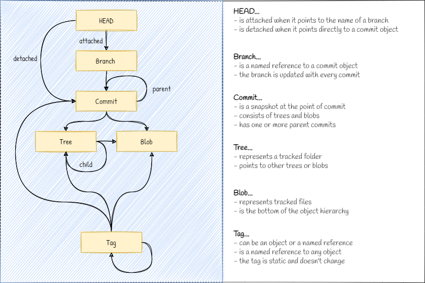

---
### Locations
```shell
$ tree .git /f

.git/refs/
│   HEAD                # Current local revision
│
├───heads               # Local branches
│       main            # Tip of the main branch
│
├───remotes             # Remote branches
│   └───origin          # Remote repository
│           HEAD        # Current remote revision
│           main        # Tip of the origin/main branch
│
└───tags                # Tag references
        V1.0.0.0        # Static reference to a revision
```

---
### HEAD
This is a file with a reference to the current revision in use. The head can
point to the tip of a branch (attached) or to a tag or directly to a revision
(detached).

```shell
# HEAD is attached (points to a tip of a branch)
$ cat .git/HEAD
ref: refs/heads/main

# HEAD is detached (points to a commit object)
$ git checkout 3002ad0adb4c6b24caea57b5f0e4be0b09de89af
$ cat .git/HEAD
$ 3002ad0adb4c6b24caea57b5f0e4be0b09de89af
```

---
### heads
This folder contains the branch tips. Each branch tip is a file with a reference
to a commit object inside it.

```shell
$ cat .git/refs/heads/main
3002ad0adb4c6b24caea57b5f0e4be0b09de89af
```

---
### remotes
This folder is used to store the tips of the remote branches. The remote repo
has also a HEAD reference. If the hash value in the file ***origin / main***
is the same as the one in ***main***, then both branches are in sync.

```shell
$ cat .git/refs/remotes/origin/main
3002ad0adb4c6b24caea57b5f0e4be0b09de89af
```

---
### tags
Tags are static labels for commit objects. Unlike the branches, they don't
change and are used as snapshots of the project in progress. Tags can point to
any object type including themselves.

```shell
$ cat .git/refs/tags/V1.0.0.0
3002ad0adb4c6b24caea57b5f0e4be0b09de89af
```

## History Navigation

Git provides several commands to move through the commit history. Each
command moves HEAD and optionally the current branch tip to a different
position.

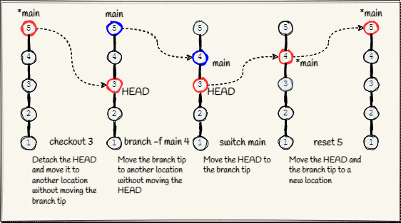

---
### checkout

Detaches HEAD and moves it to a specific commit, tag, or branch. Useful
to inspect an older revision or to create a new branch from a past commit.

```shell
$ git checkout abc1234        # detach HEAD to a specific commit
$ git checkout -b fix abc1234 # create branch "fix" starting at abc1234
```

> **Note:** For switching branches, prefer `git switch` (Git 2.23+).
> `checkout` is still valid for detaching HEAD to arbitrary commits.

---
### reset

Moves HEAD **and** the current branch tip to a new position. Depending on
the mode, it can also update the index and working tree.

```shell
$ git reset --soft HEAD~1   # undo last commit, keep changes staged
$ git reset --mixed HEAD~1  # undo last commit, unstage changes (default)
$ git reset --hard HEAD~1   # undo last commit, discard all changes
```

> **Warning:** `--hard` permanently discards uncommitted work. Use with
> caution.

---
### branch

Creates a new branch or moves an existing branch tip to a different commit.

```shell
$ git branch feature         # create branch at current HEAD
$ git branch -f feature HEAD~2  # move "feature" tip to 2 commits back
```

---
### switch

Moves HEAD to the tip of another branch. The recommended way to change
branches since Git 2.23.

```shell
$ git switch feature         # switch to existing branch
$ git switch -c hotfix       # create and switch to new branch
```

## Branching

### What exactly is a branch in Git ?

 - A branch is a pointer to a specific commit in the revision history.
 - Branches allow parallel work on the same files
 - Branches can be created, merged, renamed and deleted.

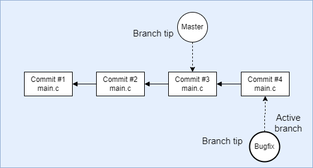

---
### Creating and using branches

To **create a new branch** means that git will **create a reference to a
specific commit**. А branch is just a pointer and git doesn't change the
project history, and it doesn't copy any files. This is why branching in git
is called a 'cheap' operation. With each change the branch will be
updated to reference the latest commit.

Here is an example workflow for git branches:

- the initial state of the repository looks like this...

  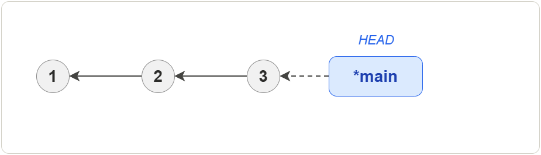

- after creating and switching to a new branch the repo changes to...

  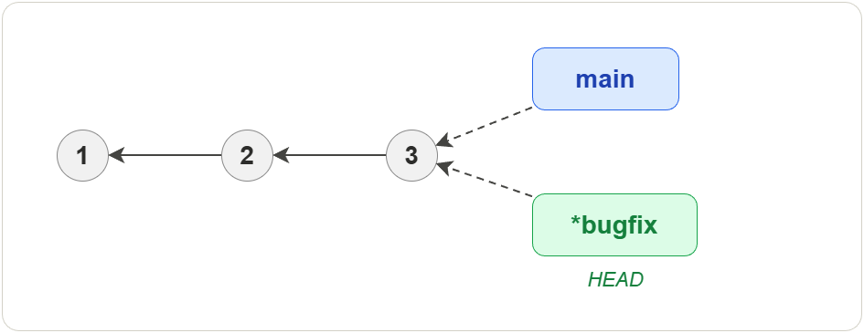

- after making a new commit to the new branch the repo changes to...

  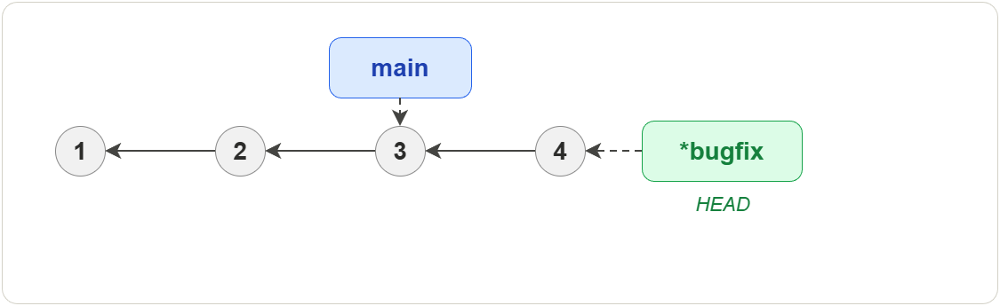

- after switching and committing to the main branch the repo changes to...

  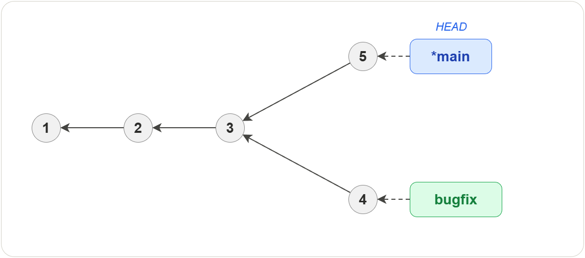

- as final the branches are merged and the repo changes to...

  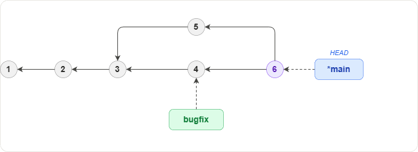

---
### Deleting branches

To **delete a branch** means that git **removes only the named
reference** to the latest commit in this branch. Git offers 2 commands to
remove an existing branch...

```shell
git branch -d <branchName>
```
will delete the branch only after the changes in the branch are merged. And
the next command...

```shell
git branch -d -f <branchName>
```
will delete the branch even if there are unmerged commits. In this case the
commits will be orphaned and will be deleted by git during the next
cleanup of the repository. The branch can thus be restored within a short
period of time, depending on count of the orphaned objects.

---
### Renaming branches

Any existing branch can be renamed using the following command
```shell
git branch -m <branchName>
```

## Merging

Merging is a process of combining changes from different branches. Usually
this is required when people are working in parallel on the same source code.
The file versions in each branch are compared and analysed line by line.

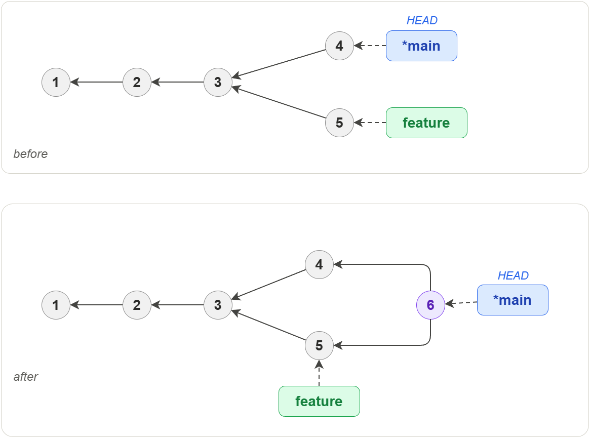

---
### Fast-forward
When only one of the branches changes the file, then git will just move the
branch tip of the target branch to match the latest revision of the file.

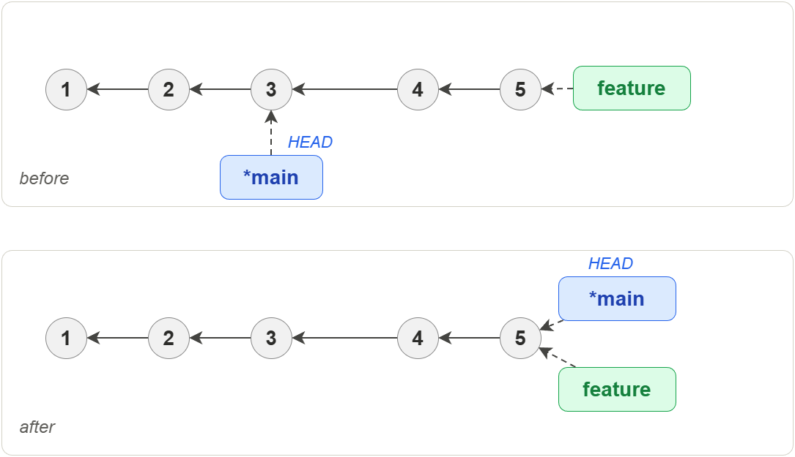

---
### Rebase
The rebasing command will copy commits from the current branch and place
them on top of another branch. Rebasing **MUST** be used only on the local
history as it can break down the development process.

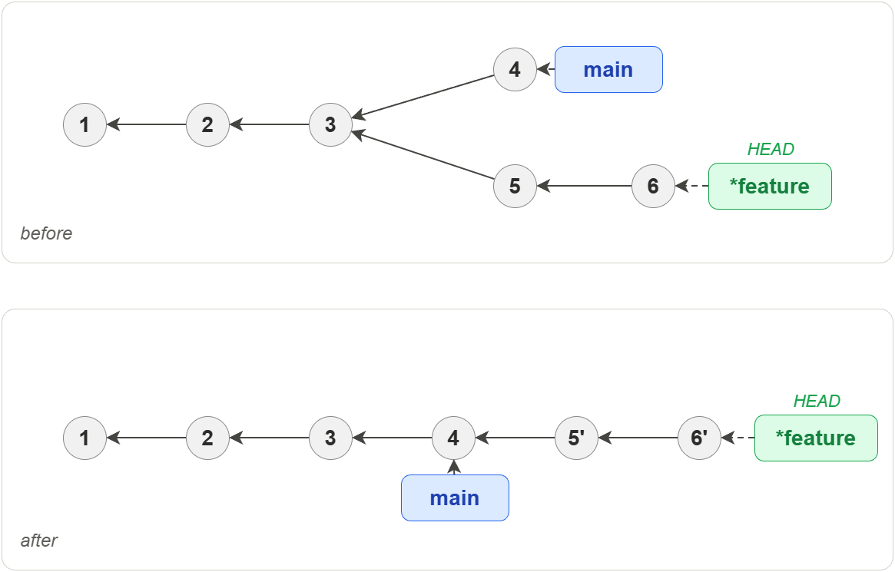

---
### 3-Way merge

When two branches have changes in the same file, then git will analyse the
files to determine how to combine the differences. The 3-way merge algorithm
uses a common ancestor and the two branch tips to perform the analysis.

It looks for sections which are the same in two of the three revisions. This
indicates that the third revision is unique and the section will be added to
the merge result. Sections that are different in all three revisions are
marked as a conflict situation and left for the user to resolve.

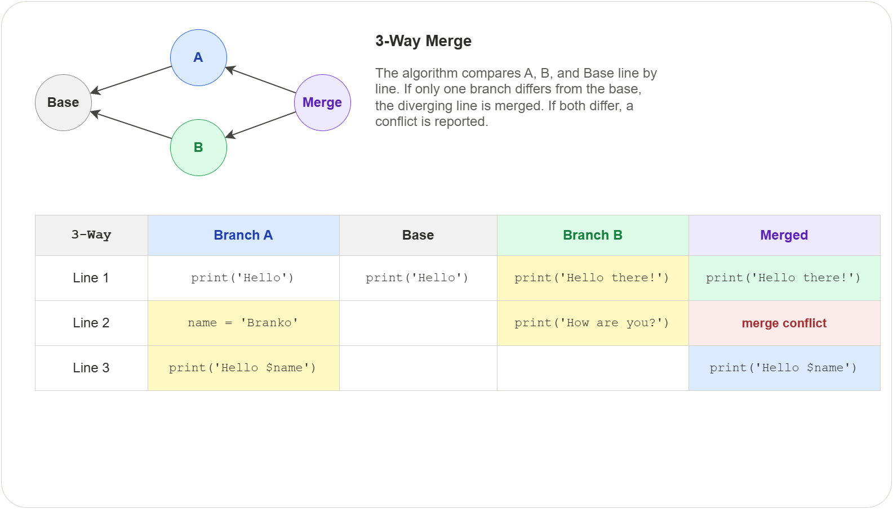

---
### Other merge strategies

 - Recursive 3-Way on two branches
 - Subtree on two branches
 - Octopus on more than two branches
 - Ours on more than two branches

## Conflicts

A merge conflict occurs when Git cannot automatically combine changes from
two branches. This happens when both branches modify the same lines in the
same file, or when one branch deletes a file that the other branch modifies.
Git stops the merge and asks the user to resolve the conflict manually.

Conflicts are a normal part of collaborative development. They do not
indicate an error — they simply mean that Git needs human judgement to
decide which changes to keep.

---
### When conflicts occur

Conflicts can arise during any operation that combines work from different
sources:

 - **Merging** — `git merge` combines two branches and finds overlapping
   changes in the same file region
 - **Rebasing** — `git rebase` replays commits on top of another branch,
   and a replayed commit touches the same lines as an existing commit
 - **Cherry-picking** — `git cherry-pick` applies a single commit from
   another branch that conflicts with the current state
 - **Pulling** — `git pull` fetches and merges remote changes that overlap
   with local changes
 - **Stash application** — `git stash pop` or `git stash apply` restores
   stashed changes that conflict with the current working tree

---
### How Git marks conflicts

When Git detects a conflict it inserts conflict markers directly into the
affected file. The markers divide the conflicting sections into two parts:

```text
<<<<<<< HEAD
This is the content from the current branch (ours).
=======
This is the content from the incoming branch (theirs).
>>>>>>> feature-branch
```

| Marker | Meaning |
|--------|---------|
| `<<<<<<< HEAD` | Start of the current branch content |
| `=======` | Separator between the two versions |
| `>>>>>>> feature-branch` | End of the incoming branch content |

The text between `<<<<<<< HEAD` and `=======` is what exists on the
current branch. The text between `=======` and `>>>>>>>` is what the
incoming branch wants to introduce. The label after `>>>>>>>` shows the
name of the branch or commit being merged in.

A single file can contain multiple conflict blocks if several regions
of the file were changed by both branches.

---
### Step-by-step resolution workflow

Resolving a conflict follows a predictable sequence:

**1. Identify the conflicting files**

After a failed merge, `git status` lists every file that needs attention:

```shell
$ git status
On branch main
You have unmerged paths.

Unmerged paths:
  (use "git add <file>..." to mark resolution)
        both modified:   src/config.yaml
        both modified:   src/main.py
```

Files marked as `both modified` contain conflict markers.

**2. Open and understand the conflict markers**

Open each conflicting file in an editor. Read both versions carefully.
Understand what each branch intended before deciding how to resolve the
conflict. Look at the surrounding context — the unchanged lines above and
below the markers often clarify the intent of each change.

**3. Edit to resolve**

There are three common resolution strategies:

 - **Keep one side** — delete the markers and the content from the side
   you do not want
 - **Combine both** — merge the two versions into a single coherent result
   and remove all markers
 - **Rewrite** — discard both versions and write something entirely new
   that satisfies the intent of both changes

After editing the file must not contain any conflict markers. Any remaining
`<<<<<<<`, `=======`, or `>>>>>>>` lines will cause problems.

**4. Stage resolved files**

Once a file is resolved, stage it to tell Git the conflict is handled:

```shell
git add src/config.yaml
git add src/main.py
```

**5. Complete the merge**

After all conflicts are staged, finalize the merge with a commit:

```shell
git commit
```

Git pre-fills the commit message with merge information. You can accept
the default or edit it to describe how the conflicts were resolved.

---
### Aborting a conflicted merge

If the conflicts are too complex or the merge was started by mistake,
you can abandon it entirely:

```shell
git merge --abort
```

This restores the repository to the state it was in before the merge
began. All conflict markers and staged resolutions are discarded. The
working tree and index return to the pre-merge state.

This command is safe — it does not delete any commits or branches.

---
### Conflicts during rebase

Rebasing replays commits one at a time, so conflicts can occur at each
step. The workflow differs slightly from a merge conflict:

```shell
$ git rebase main
CONFLICT (content): Merge conflict in src/main.py
error: could not apply abc1234... Add feature X
```

**1.** Resolve the conflict in the file as described above.

**2.** Stage the resolved file:

```shell
git add src/main.py
```

**3.** Continue the rebase to process the next commit:

```shell
git rebase --continue
```

If more commits produce conflicts, Git stops again and the process
repeats. To abandon the entire rebase and return to the original state:

```shell
git rebase --abort
```

To skip the current conflicting commit entirely (dropping its changes):

```shell
git rebase --skip
```

---
### Using merge tools

Git can launch a graphical or terminal-based merge tool to help resolve
conflicts visually:

```shell
git mergetool
```

This opens each conflicting file in the configured tool. Popular merge
tools include **vimdiff**, **meld**, **kdiff3**, **Beyond Compare**, and
**VS Code**. To set a default tool:

```shell
git config --global merge.tool meld
```

Most merge tools display three panes — the base version (common ancestor),
the current branch version, and the incoming branch version — alongside a
result pane where you build the final output.

After the tool saves the resolved file, Git marks it as resolved. Some
tools create `.orig` backup files. To disable these:

```shell
git config --global mergetool.keepBackup false
```

---
### Preventing conflicts

Conflicts cannot be eliminated entirely, but their frequency and severity
can be reduced:

 - **Communicate** — coordinate with team members about who is working on
   which files to avoid overlapping changes
 - **Keep branches short-lived** — the longer a branch diverges from the
   main line, the higher the chance of conflicts
 - **Pull frequently** — regularly integrate upstream changes into your
   branch with `git pull` or `git rebase` to stay close to the latest state
 - **Make small, focused commits** — smaller changes are easier to merge
   and produce simpler conflicts when they do occur
 - **Avoid reformatting entire files** — whitespace-only or style-only
   changes across a whole file create conflicts with every other branch
   that touches that file
 - **Use `.gitattributes`** — define merge strategies for specific file
   types (e.g., always accept ours for generated lock files)

---
### Practical example

Two developers work on the same file. Alice changes a greeting on the
`main` branch, and Bob changes it on a `feature` branch.

**Initial file (`greeting.txt`) on both branches:**
```text
Hello, welcome to the project.
```

**Alice's change on `main`:**
```text
Hello, welcome to the project! We are glad you are here.
```

**Bob's change on `feature`:**
```text
Hi there, welcome to the project.
```

When Bob merges `main` into his branch, Git produces a conflict:

```shell
$ git merge main
Auto-merging greeting.txt
CONFLICT (content): Merge conflict in greeting.txt
Automatic merge failed; fix conflicts and then commit the result.
```

The file now contains:

```text
<<<<<<< HEAD
Hi there, welcome to the project.
=======
Hello, welcome to the project! We are glad you are here.
>>>>>>> main
```

Bob decides to combine both changes:

```text
Hi there, welcome to the project! We are glad you are here.
```

He removes all conflict markers, stages the file, and completes the merge:

```shell
git add greeting.txt
git commit -m "Merge main into feature, combine greeting changes"
```

The conflict is resolved and the repository history records the merge.

## Stashing

The stash allows changes to be saved without committing broken or untested
code before switching to another branch.

---
### Location
The stash is a file in the ***.git/refs*** directory. It contains a
reference to a temporary commit object reflecting the changes made to the
work project.

```shell
$ cat .git/refs/stash
095ad9c4de6932e47f2e59ea7c1e554274a52a37
```

---
### Concept
The stash is a sequence of blob, tree and commit objects. When the stash
command is applied, the following steps take place:

1. A blob object is created for each
   - Modified tracked file
   - Untracked file (with the -u option)
   - Ignored file (with the -a option)
2. A tree object is created for each blob object from (1)
3. A commit object is created for the tracked files
4. A commit object is created for the untracked files
5. A commit object is created representing the stashed changes

The last step creates a commit object with three parents: the original
revision, the revision of the tracked files and the revision of the
untracked files.

```shell
$ git cat-file -p e2ec
tree 4984c1da7bd1e1e5ad45660e0dc183be624de8e9
parent 1cb1d1549ceb4149dc5cc36e9ba3d06ca6f0bdc2 # Last revision
parent 595518729d768588acd2068dc70605a415af26f1 # Revision of tracked files
parent 48708dc0278f7a470b5adee6f3c0097fceaa2ca2 # Revision of untracked files
author Your Name <your.email@example.com> 1641674534 +0200
committer Your Name <your.email@example.com> 1641674534 +0200

WIP on main: 1cb1d15 init
```
When the stashed changes are restored, git will follow the parents of the
stash commit to restore the files in the project folder.

## Revision Selectors

Revision selectors (treeish) are special type of operators used to select single or
multiple revisions from the commit history. The selection can then be used to
either move the HEAD back in history or in combination with diagnostic tools.

---
### Ancestry selectors

#### ~
The tilde operator is used to move vertically in a linear commit history.
This operator follows always the path of the first parent. In the
diagram below this would be C1, C2, C4, C5 and C6. The other commits from
the diagram are not accessible using this operator.

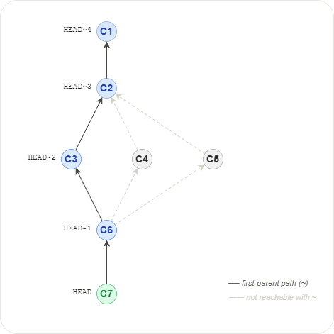

#### ^
The caret operator is useful to move horizontally in a non-linear commit
history. For example in the diagram below C3, C4 and C5 are the parents of
C6. The commit C3 as first parent can be referenced by ^1, C4 as second
parent by ^2 and C5 as third parent by ^3.

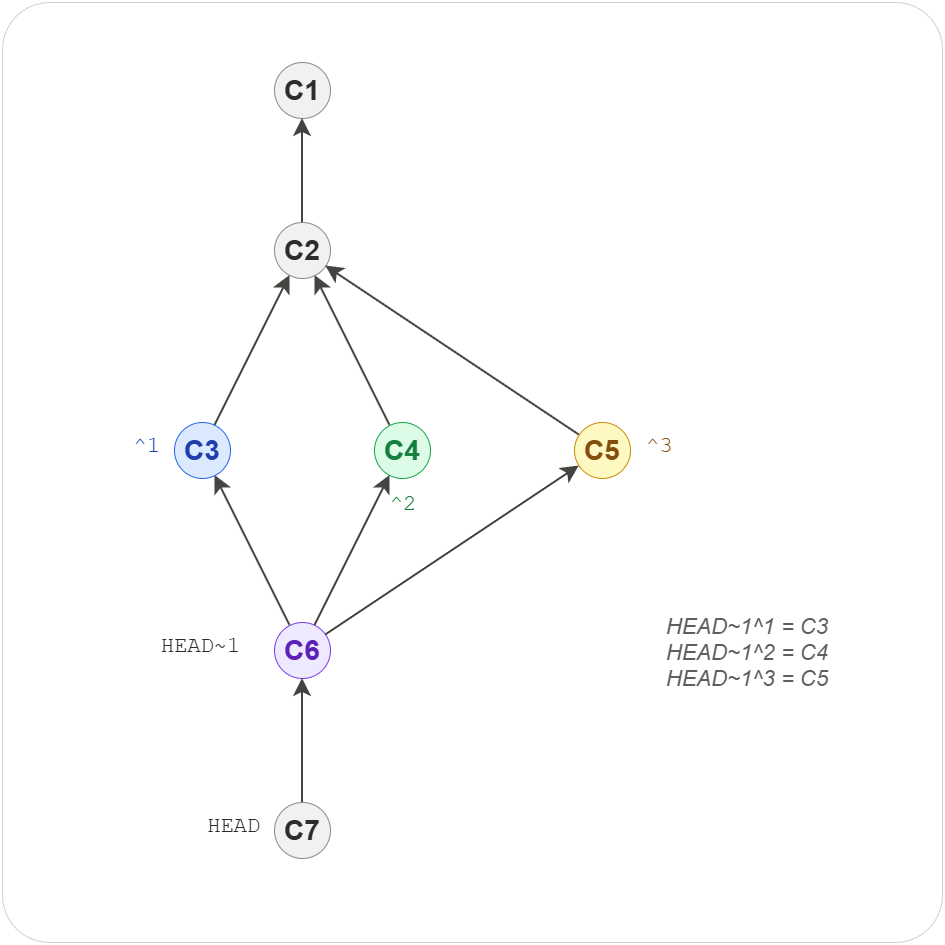

---
### Range selectors

#### ..
The double dot operator is the difference between two sets A and B. If A
has {1, 2, 3} and B has {1, 2, 4} then the result of the double dot operator
will be {4}. The double dot operator can be replaced with ^ or --not for
queries requiring more than 2 branches.

```shell
$ git log refA..refB          # Reachable from B but not from A
$ git log refB ^refA          # Reachable from B but not from A
$ git log refB --not refA     # Reachable from B but not from A
```

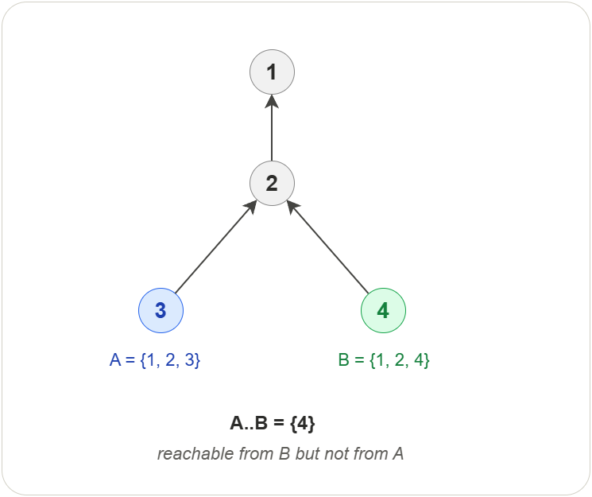

#### ...
The triple dot operator is the symmetric difference between two sets A and B.
If A has {1, 2, 3} and B has {2, 3, 4} then the result of the triple dot
operator will be {1, 4}. The symmetric difference returns elements unique to
each set.

```shell
git log --left-right main...test
```
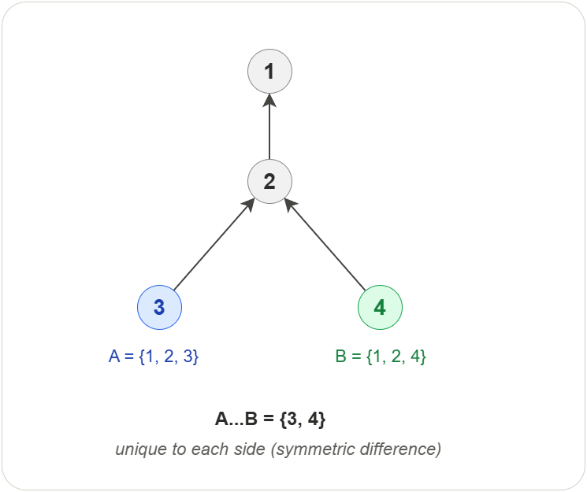

---
### Reflog selectors
The @ operator is used to browse the local reflog history relative to a
well-defined reference such as HEAD or a branch.

- 1.minute.ago
- 1.hour.ago
- 1.day.ago or yesterday
- 1.week.ago
- 1.month.ago
- 1.year.ago

```shell
# Show all reflogs starting from entry #1
$ git log "main@{now}"

# Show all reflogs starting from entry #1
$ git log "HEAD@{1}"

# Show all reflogs starting from yesterday
$ git log "HEAD@{yesterday}"

# Show all reflogs starting from 2 months ago
$ git log "HEAD@{2.months.ago}"
```

---
### Practice

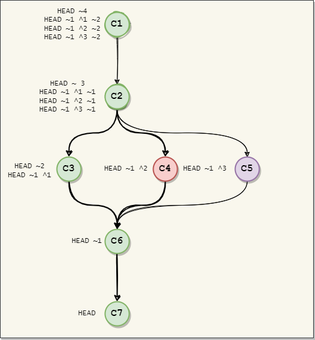

## Pathspec

- A pathspec is a pattern used to match a path or a set of paths
- A path is a file or a directory
- A pattern can be a combination of names, wildcards and signatures
- Signatures are special words used to control the matching process

---
### Files and directories

```shell
git add .               # Add current working directory
git add src/            # Add src/ directory
git add src/ header/    # Add multiples paths
```

---
### Wildcards

The asterisks **(\*)** wildcard character matches any number of characters.

```shell
git log '*.py'      # Show history of all python files
git log '.*'        # Show history of all files and directories
git log 'qa*.py'    # Show history of all python files starting with qa
```

The question mark ***(?)*** can be used to match a single symbol.

```shell
git ls-files '*.mp?'    # Files with 3 symbols and first two are 'mp'
```

The brackets ***[ ]*** can be used to match a single character out of a set.

```shell
git ls-files '*.mp[34]'  # Match exactly mp3 and mp4 files
```

---
### Magic signatures
Magic signatures are special words provided by git to control the
result of the matching process.

```shell
# Syntax
:(signature)pattern

# Signatures
top (/), exclude (!), icase, literal, glob, attr

# Examples
':/*.mp3'               # All mp3 files starting form the repo root
':!*.md'                # Everything except md files
':(icase)*.jpg'         # Both lower and upper case for jpg
':(literal)Maybe?.mp3'  # File Maybe?.mp3 with ? in the name
':(attrib:!debug)*'     # All paths not having the attribute debug
':(top,icase)*.mp?'     # Combination of signatures
```

---
### top
Match the pattern from the root of the git repository rather than the
current working directory.

---
### exclude
First resolve other patterns and then use **exclude** to remove a set of
paths from the result.

---
### icase
Ignore case when matching.

---
### literal
Treat all the characters literally. Useful to use wildcards as letters
rather than wildcard symbols.

---
### glob
Unix like matching when using the asterisks (*) wildcard characters. In this
case glob will change the matching behavior as follows:

- (*) will not match through directories
- (**) will match through directories

---
### attr
Match folders using git attributes. Depending on the usecase git offers two
locations to define attributes:

- .gitattributes (tracked)
- .git/info/attributes (untracked)

---
### Commands accepting pathspecs

- add
- log
- checkout
- clean
- diff
- grep
- ls-files
- rm

## Refspec

The refspec is a special syntax used by git to map remote branches to the
local repository.

---
### Syntax
```shell
[+]<src>:<dst>

+   : Force update of branch tip (fast forward)
src : Source location (remote branch)
dst : Destination location (local branch)
```

---
### Branch mapping
Refspecs are usually found in the .git/config file after ***cloning*** or
configuration with ***git remote***.

```shell
Example:
$ git config --local --edit

...
[remote "origin"]

    # Repository link
    url = https://github.com/user/project.git

    # Mapping for the fetch command
    fetch = +refs/heads/*:refs/remotes/origin/*

    # Mapping for the push command
    push = refs/heads/main:refs/heads/main
```

In the example above the first refspec is **fetch** and it maps all remote
branches from origin to the folder **refs/remotes/origin** in the local
repository. The second refspec will map the main branch from the local repo
to the main branch in the remote repo.

---
### Creating remote branches
Local branches can also be used to create remote branches using ***git push***
and refspecs.

```shell
git push origin main:refs/heads/test_master
```

---
### Deleting remote branches
Remote branches can be deleted by leaving source in the refspec empty.

```shell
git push origin :refs/heads/feature
```

---
### Commands accepting refspecs

- git remote
- git fetch
- git pull
- git push

## Subprojects

Very often a source code has to be **reused** in many projects. Code
which is reused is also called a **module**, a **library**, a **framework**,
or a **package**. It is not feasible to copy the code each time, as
each copy must be maintained manually. It is much easier to have a central
repository with the reused code and let git automate the copying and
synchronization of the files. Git offers two popular solutions for
this: **submodule** and **subtree**.

---
### Submodules

- A small footprint size
- A submodule is a **reference to a specific commit** of another repository
- A submodule **must be updated manually** to clone the submodule
- A special folder **.git/modules hosts the submodules objects** after update
- A submodule **links a branch or a specific revision**
- A repository can have **more than one** submodule
- Submodules can be **nested**

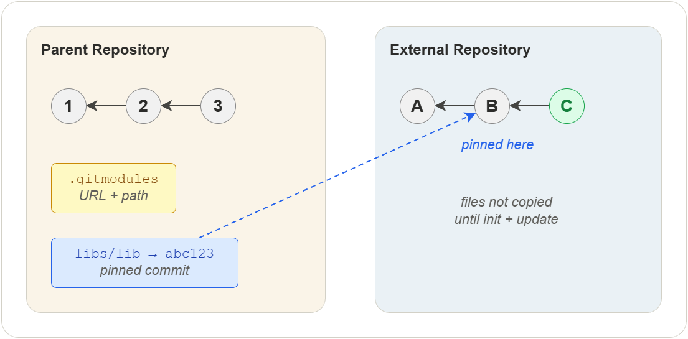

#### Why submodules?
- Submodules are native to git
- Submodule repositories have their own commit history
- A new submodule version can be released without affecting the project
- A checkout to a different revision of the submodule doesn't affect the project
- Usually used for bigger project where checkout times can be significant

#### Submodules drawbacks
- No automatic updates for the submodule
- Use of additional set of commands to handle submodules
- Nested submodules are omitted by default
- Merging changes from the project into the submodules are difficult

See also: [Operations — Reuse](11-operations-reuse.md)

---
### Subtrees

- A transparent view of the code base
- A subtree is a **full copy of another repository** with files and history
- A subtree can be handled **using standard commands**
- A repository can have **more than one subtree**
- Subtrees are **not nested**

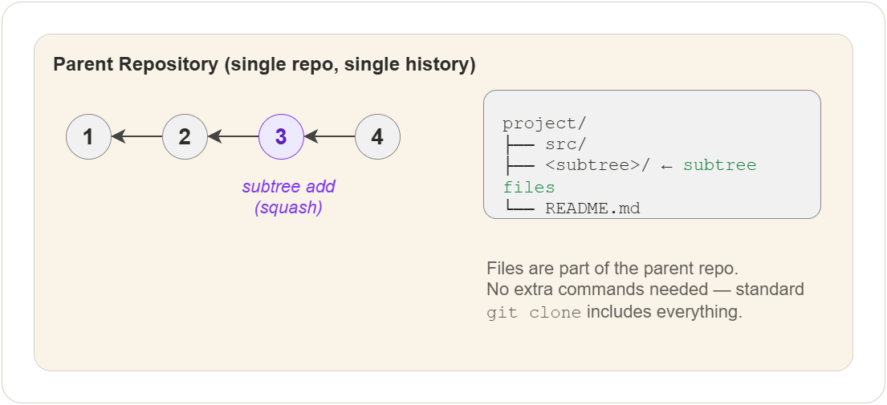

#### Why subtrees?
- A subtree can be updated using standard commands (clone or pull)
- A subtree is easier to use for branching and merging
- A subtree doesn't add metadata files
- Older version of git are supported (even before v1.5.2)
- Usually used for integrated projects with frequent commits

#### Subtree drawbacks
- Subtree is a tool and not native to git
- Subtrees require a deeper understanding of git merging strategies
- Special attention of not mixing project and subtree code in commits
- A checkout to a different revision will affect all the project files
- Not recommended when the amount of dependencies is too large.

---
### Which to use?

> **Git submodules** is more fit to a ***component-based development*** where
> the project depends on a specific version (commit) of an external
> repository and the user doesn't change the code of the submodule or the
> submodule doesn't change frequently.

> **Git subtrees** is more fit to a ***system-based development*** where the
> user wants to have a full copy all files and their history and the
> subtree will be changed frequently either by the maintainer or by the
> user himself.

---
### Other tools

- [google repo](https://gerrit.googlesource.com/git-repo/)
- [git subrepo](https://github.com/ingydotnet/git-subrepo#readme)
- [git slave](https://sourceforge.net/p/gitslave/code/ci/master/tree)

## Configuration

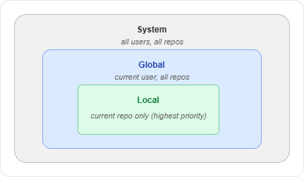

Git uses a layered configuration system. Settings at a more specific level
override those at a broader level: local > global > system.

---
### Local configuration

The ***local configuration*** file is placed in the .git folder under the name
***config***. The local configuration file is used to manage only the parameters
of the current repository.

```shell
$ git config --local --edit
[core]
        repositoryformatversion = 0
        filemode = false
        bare = false
        logallrefupdates = true
        symlinks = false
        ignorecase = true
[remote "origin"]
        url = /path/to/project.git
        fetch = +refs/heads/*:refs/remotes/origin/*
[branch "main"]
        remote = origin
        merge = refs/heads/main
```

---
### Global configuration

The location of the ***global configuration*** file vary depending on the
operating system used. The name of the file is ***.gitconfig***. Under Windows
the file is placed in ***C:\users\\<username\>***. The global configuration is
used to configure git for all repositories of the current user.

```shell
$ git config --global --edit
[user]
	name = Your Name
	email = your.email@example.com
[core]
	longpaths = true
	autocrlf = true
[credential]
	helper = manager
[init]
	defaultBranch = main
[alias]
	hist = log --pretty=format:'%h %ad | %s%d [%an]' --graph --date=short
	type = cat-file -t
	dump = cat-file -p
```

---
### System configuration

The ***system configuration*** file also depends on the operating system
used. Its name is ***gitconfig*** and under Windows it is to be found in the
installation folder of git. The system configuration is used to configure git
for all users and all repositories.

```shell
$ git config --system --edit

[diff "astextplain"]
	textconv = astextplain
[http]
	sslBackend = openssl
	sslCAInfo = /path/to/ssl/certs/ca-bundle.crt
[core]
	autocrlf = true
	fscache = true
	symlinks = false
[pull]
	rebase = false
[credential]
	helper = manager-core
[init]
	defaultBranch = main
```

---
### Practice

1. Configure the username and email for the current user
2. Configure the editor for all users

## Branching Strategies

A branching strategy is a set of rules that a team agrees on for creating,
naming, merging, and deleting branches. Without a shared strategy, repositories
become cluttered with long-lived branches, merge conflicts grow, and releases
become unpredictable. Choosing the right strategy depends on team size, release
cadence, and deployment model.

---
### Git Flow

Git Flow, introduced by Vincent Driessen in 2010, uses five branch types to
manage releases and parallel development.

**Branch types:**

| Branch | Lifetime | Purpose |
|--------|----------|---------|
| `main` | Permanent | Production-ready code. Every commit is a release. |
| `develop` | Permanent | Integration branch for the next release. |
| `feature/*` | Temporary | New functionality. Branches off `develop`, merges back into `develop`. |
| `release/*` | Temporary | Release preparation and stabilization. Branches off `develop`, merges into both `main` and `develop`. |
| `hotfix/*` | Temporary | Urgent production fixes. Branches off `main`, merges into both `main` and `develop`. |

**Typical workflow:**

1. Developers create `feature/*` branches from `develop`.
2. Completed features merge back into `develop`.
3. When `develop` is ready for release, a `release/*` branch is created.
4. Bug fixes go into the release branch; no new features are added.
5. The release branch merges into `main` (tagged) and back into `develop`.
6. Critical production bugs get a `hotfix/*` branch from `main`.

**When to use:**

- Products with versioned releases (v1.0, v2.0)
- Multiple environments (dev, staging, production)
- Teams that need to support older versions in parallel

**Pros:**

- Clear separation between development, stabilization, and production
- Supports multiple release versions simultaneously
- Well-defined process for hotfixes

**Cons:**

- High branch overhead — five branch types to manage
- Merge conflicts accumulate on long-lived `develop` and `release` branches
- Slower feedback loop — changes pass through multiple branches before release
- Overkill for teams that deploy continuously

---
### GitHub Flow

GitHub Flow is a simplified strategy designed around continuous deployment. It
uses only two branch types: `main` and short-lived feature branches.

**Typical workflow:**

1. `main` is always deployable.
2. Create a feature branch from `main` for any change.
3. Commit to the feature branch and open a pull request.
4. The team reviews the pull request.
5. Merge into `main` and deploy immediately.

**When to use:**

- Web applications with continuous deployment
- Small to medium teams
- Projects where there is only one production version

**Pros:**

- Simple — only two branch types
- Fast feedback — changes reach production quickly
- Pull requests enforce code review as a natural part of the workflow
- Easy to automate with CI/CD pipelines

**Cons:**

- No built-in concept of releases or versioning
- Assumes `main` is always deployable, which requires strong test coverage
- Does not handle multiple supported versions well
- Hotfixes follow the same path as features — no fast lane

---
### Trunk-Based Development

Trunk-Based Development (TBD) takes simplification further. Developers commit
directly to `main` (the trunk) or use very short-lived branches that are merged
within hours, not days.

**Key practices:**

- Branches live for less than one day whenever possible.
- Feature flags hide incomplete work so the trunk stays releasable.
- Continuous integration runs on every push to the trunk.
- Code review happens before merge (pair programming or rapid PR review).

**When to use:**

- Teams with mature CI/CD pipelines and high test coverage
- Experienced developers comfortable with small, incremental changes
- Organizations that deploy multiple times per day

**Pros:**

- Minimal merge conflicts because branches are short-lived
- Fastest possible integration feedback
- Encourages small, focused commits
- Reduces the complexity of branch management to near zero

**Cons:**

- Requires strong CI/CD infrastructure and automated testing
- Feature flags add code complexity and need cleanup
- Less suitable for teams with junior developers or infrequent releases
- Direct trunk commits can destabilize the build without discipline

---
### Comparison

| Aspect | Git Flow | GitHub Flow | Trunk-Based |
|--------|----------|-------------|-------------|
| Branch types | 5 | 2 | 1–2 |
| Branch lifetime | Days to weeks | Hours to days | Hours |
| Release model | Versioned | Continuous | Continuous |
| Merge complexity | High | Low | Minimal |
| CI/CD requirement | Optional | Recommended | Essential |
| Multiple versions | Yes | No | No |
| Team size | Medium to large | Small to medium | Any (experienced) |
| Learning curve | Steep | Low | Low |

---
### How to choose

There is no universally correct strategy. Use these questions to narrow down
the options:

1. **How often do you release?** If you release on a fixed schedule with version
   numbers, Git Flow gives you the structure for that. If you deploy on every
   merge, GitHub Flow or Trunk-Based Development is a better fit.

2. **Do you support multiple versions?** If customers run different versions in
   production and you need to ship patches to older releases, Git Flow handles
   this naturally. The other strategies assume a single production version.

3. **How strong is your CI/CD pipeline?** Trunk-Based Development depends on
   fast, reliable automated tests. Without them, broken commits reach production.
   If your test infrastructure is still maturing, GitHub Flow with pull request
   checks is a safer starting point.

4. **How large is the team?** Trunk-Based Development works well at any scale
   but requires discipline. Git Flow provides guardrails that help larger teams
   coordinate. GitHub Flow sits in the middle.

5. **Can you use feature flags?** If your tooling supports feature flags,
   Trunk-Based Development becomes practical even for large features. Without
   feature flags, short-lived branches may not be feasible for multi-week work.

Start simple. GitHub Flow is a good default for most teams. Move to Git Flow
when you need versioned releases or multi-version support. Move to Trunk-Based
Development when your CI/CD maturity and team discipline allow it.

## Exercises

Hands-on exercises for reinforcing the concepts covered in this section.
All exercises use a fresh, disposable repository unless stated otherwise.

---

### Exercise 1: Create and Inspect a Repository

**Task:** Initialize a new Git repository and explore its internal structure.

**Steps:**

1. Create a new directory called `concepts-lab` and navigate into it
2. Run `git init` to create a repository
3. List the contents of the `.git` directory
4. Identify the `objects`, `refs/heads`, and `refs/tags` subdirectories
5. Read the `HEAD` file and note what it points to
6. Create a bare repository called `concepts-lab.git` in a sibling directory using `git init --bare`
7. Compare the directory structure of the bare repository with the `.git` folder

**Verify:**

The `.git` directory exists and contains `objects`, `refs`, `HEAD`, and `config`. The bare repository has the same internal structure but no working tree.

---

### Exercise 2: Explore Git Objects

**Task:** Create blobs, trees, and commits, then inspect them with plumbing commands.

**Steps:**

1. In `concepts-lab`, create a file called `hello.txt` with the content `Hello, Git!`
2. Stage the file with `git add hello.txt`
3. Run `git ls-files --stage` and note the blob hash next to the file name
4. Inspect the blob content using `git cat-file -p <blob-hash>`
5. Inspect the blob type using `git cat-file -t <blob-hash>`
6. Commit the file
7. Run `git log --format=raw -1` to see the commit object and note the tree hash
8. Inspect the tree using `git cat-file -p <tree-hash>`
9. Verify that the tree references the same blob hash from step 3
10. Browse the `.git/objects` directory and locate the two-character subdirectory matching the first two characters of the blob hash

**Verify:**

`git cat-file -p` on the blob prints `Hello, Git!`. The tree object lists the blob hash with mode `100644` and file name `hello.txt`. The corresponding object file exists on disk under `.git/objects`.

---

### Exercise 3: Lightweight and Annotated Tags

**Task:** Create both tag types and compare how Git stores them internally.

**Steps:**

1. In `concepts-lab`, make sure you have at least one commit
2. Create a lightweight tag called `v0.1` using `git tag v0.1`
3. Create an annotated tag called `v1.0` with the message `First release` using `git tag -a v1.0 -m "First release"`
4. List all tags with `git tag`
5. Read the lightweight tag reference file at `.git/refs/tags/v0.1` and note the hash
6. Read the annotated tag reference file at `.git/refs/tags/v1.0` and note the hash
7. Run `git cat-file -t` on both hashes and compare the object types
8. Run `git cat-file -p` on the annotated tag hash and inspect the tagger, date, message, and target reference

**Verify:**

The lightweight tag hash points directly to a commit object (`git cat-file -t` prints `commit`). The annotated tag hash points to a tag object (`git cat-file -t` prints `tag`), which in turn references the commit.

---

### Exercise 4: Stage, Unstage, and Inspect the Index

**Task:** Use the index to selectively stage changes and observe its contents.

**Steps:**

1. In `concepts-lab`, create two files: `tracked.txt` and `experimental.txt`
2. Stage only `tracked.txt` with `git add tracked.txt`
3. Run `git ls-files --stage` to see what is in the index
4. Run `git status` and note which file is staged and which is untracked
5. Now stage `experimental.txt` with `git add experimental.txt`
6. Run `git ls-files --stage` again and confirm both entries appear
7. Remove `experimental.txt` from the index without deleting the file using `git rm --cached experimental.txt`
8. Run `git ls-files --stage` a final time and confirm only `tracked.txt` remains
9. Commit the staged file

**Verify:**

After step 7, `git ls-files --stage` shows only `tracked.txt`. After the commit, `git status` shows `experimental.txt` as untracked and the working tree is otherwise clean.

---

### Exercise 5: Create, Switch, and Delete Branches

**Task:** Practice the full branch lifecycle and observe how references change.

**Steps:**

1. In `concepts-lab`, confirm you are on the `main` branch with `git branch`
2. Read `.git/refs/heads/main` and note the commit hash
3. Create a new branch called `feature/greeting` using `git branch feature/greeting`
4. Read `.git/refs/heads/feature/greeting` and confirm it points to the same commit
5. Switch to the new branch with `git switch feature/greeting`
6. Read `.git/HEAD` and confirm it now references `refs/heads/feature/greeting`
7. Create a new file `greeting.txt`, stage, and commit it
8. Read `.git/refs/heads/feature/greeting` again and confirm it advanced to the new commit
9. Read `.git/refs/heads/main` and confirm it still points to the original commit
10. Switch back to `main` and delete the branch with `git branch -d feature/greeting`

**Verify:**

After deletion, the file `.git/refs/heads/feature/greeting` no longer exists. `git branch` lists only `main`. The commit created on the feature branch becomes unreachable.

---

### Exercise 6: Three-Way Merge with a Conflict

**Task:** Create a merge conflict, inspect the conflict markers, and resolve it manually.

**Steps:**

1. In `concepts-lab`, create a file `config.txt` with the line `mode=production` and commit it on `main`
2. Create and switch to a branch `feature/debug` using `git switch -c feature/debug`
3. Change the line in `config.txt` to `mode=debug` and commit
4. Switch back to `main`
5. Change the same line in `config.txt` to `mode=staging` and commit
6. Run `git merge feature/debug`
7. Open `config.txt` and locate the conflict markers (`<<<<<<<`, `=======`, `>>>>>>>`)
8. Run `git ls-files --stage` and observe the three stage entries (base, ours, theirs) for `config.txt`
9. Edit `config.txt` to resolve the conflict by choosing one value or combining them
10. Stage the resolved file with `git add config.txt` and complete the merge with `git commit`

**Verify:**

After the merge commit, `git log --oneline --graph` shows the two branches converging. `git ls-files --stage` shows a single stage-0 entry for `config.txt`. The file contains the resolved content with no conflict markers.

---

### Exercise 7: Stash and Restore Work in Progress

**Task:** Use the stash to save uncommitted changes, switch branches, then restore them.

**Steps:**

1. In `concepts-lab`, make sure you are on `main` with a clean working tree
2. Create a file `notes.txt` with the content `Work in progress`
3. Stage the file with `git add notes.txt`
4. Run `git stash push -m "wip: notes"` to save the changes
5. Confirm the working tree is clean with `git status`
6. Run `git stash list` and note the stash entry `stash@{0}`
7. Inspect the stash reference at `.git/refs/stash` and run `git cat-file -p` on it
8. Create and switch to a new branch `feature/other`, make any commit, then switch back to `main`
9. Restore the stashed changes with `git stash pop`
10. Confirm `notes.txt` is back in the working tree and staged

**Verify:**

After `git stash pop`, `git status` shows `notes.txt` as a staged new file. `git stash list` is empty.

---

### Exercise 8: Partial Staging with the Index

**Task:** Stage only some changes from a single file to make a focused commit.

**Steps:**

1. In `concepts-lab`, create a file `multi.txt` with three lines: `line1`, `line2`, `line3` and commit it
2. Modify the file so that `line1` becomes `LINE1` and `line3` becomes `LINE3` (leave `line2` unchanged)
3. Run `git diff` to confirm both hunks appear
4. Use `git add -p multi.txt` to interactively stage only the first hunk (the change to `line1`)
5. Run `git diff --cached` and confirm only the `line1` change is staged
6. Run `git diff` and confirm the `line3` change remains in the working tree
7. Commit the staged hunk
8. Stage and commit the remaining change

**Verify:**

`git log --oneline` shows two separate commits. Running `git diff HEAD~1 HEAD~2` shows only the `line1` change. Running `git diff HEAD HEAD~1` shows only the `line3` change.

---

### Exercise 9: Configure User Identity at Two Levels

**Task:** Set user name and email at the local and global levels and observe which one takes precedence.

**Steps:**

1. Inside `concepts-lab`, set a global user name and email using `git config --global`
2. Set a different local user name and email using `git config --local`
3. Run `git config --list --show-origin` to see all active settings and their sources
4. Create a file, stage it, and commit it
5. Run `git log` and check which user name and email appear in the commit
6. Remove the local overrides using `git config --local --unset user.name` and `git config --local --unset user.email`
7. Make another commit and verify the global identity is now used

**Verify:**

The first commit shows the local identity. The second commit shows the global identity. `git config --list --show-origin` displays both levels and marks which file each setting comes from.

---

### Exercise 10: Simulate a Branching Strategy

**Task:** Apply a simplified Git Flow workflow using branches and merges.

**Steps:**

1. Create a fresh repository called `flow-lab` and navigate into it
2. Create an initial commit on `main` with a file `app.txt` containing `v1.0`
3. Create a `develop` branch from `main` and switch to it
4. Create a `feature/login` branch from `develop`, add a file `login.txt`, and commit
5. Merge `feature/login` into `develop` and delete the feature branch
6. Create a `release/1.1` branch from `develop`
7. On the release branch, update `app.txt` to `v1.1` and commit the change
8. Merge `release/1.1` into `main` and tag `main` with an annotated tag `v1.1`
9. Merge `release/1.1` into `develop` to bring the version bump back
10. Delete the release branch
11. Run `git log --oneline --graph --all` to visualize the full history

**Verify:**

`main` and `develop` both contain the `v1.1` change and the `login.txt` file. The tag `v1.1` exists and points to the merge commit on `main`. The feature and release branches are deleted. The graph shows the expected merge topology.

## Quiz

Test your understanding of the concepts covered in this chapter.

**Q1.** What is the difference between a bare and a non-bare repository?

- A) A bare repository has no branches
- B) A bare repository has no working tree — only the `.git` internals
- C) A non-bare repository cannot be pushed to
- D) A bare repository does not store commit history

**Q2.** Which Git object type stores the contents of a file?

- A) Commit
- B) Tree
- C) Blob
- D) Tag

**Q3.** What does the index (staging area) contain?

- A) A list of all commits in the repository
- B) A sorted list of file names, modes, and blob hashes for the next commit
- C) The difference between two branches
- D) A copy of the remote repository state

**Q4.** What does HEAD point to when it is "attached"?

- A) The root commit of the repository
- B) The most recent tag
- C) The tip of the current branch (a ref in `refs/heads/`)
- D) The remote tracking branch

**Q5.** What happens when you run `git reset --hard HEAD~1`?

- A) The last commit is moved to a new branch
- B) HEAD and the branch tip move back one commit; index and working tree are updated to match
- C) The last commit is deleted from the remote
- D) A new commit is created that reverses the previous one

**Q6.** In a 3-way merge, what are the three revisions Git compares?

- A) HEAD, the index, and the working tree
- B) The common ancestor, the current branch tip, and the incoming branch tip
- C) The first commit, the last commit, and the tag
- D) The local, global, and system configurations

**Q7.** What is the main difference between a lightweight and an annotated tag?

- A) Lightweight tags can be pushed; annotated tags cannot
- B) Annotated tags are full Git objects with metadata; lightweight tags are plain references
- C) Lightweight tags point to trees; annotated tags point to blobs
- D) There is no difference — they are aliases for the same thing

**Q8.** Which branching strategy uses `main`, `develop`, `feature/*`, `release/*`, and `hotfix/*` branches?

- A) GitHub Flow
- B) Trunk-Based Development
- C) Git Flow
- D) Feature Branch Workflow

### Answers

1. B — A bare repository has no working tree — only the `.git` internals
2. C — Blob
3. B — A sorted list of file names, modes, and blob hashes for the next commit
4. C — The tip of the current branch (a ref in `refs/heads/`)
5. B — HEAD and the branch tip move back one commit; index and working tree are updated to match
6. B — The common ancestor, the current branch tip, and the incoming branch tip
7. B — Annotated tags are full Git objects with metadata; lightweight tags are plain references
8. C — Git Flow
