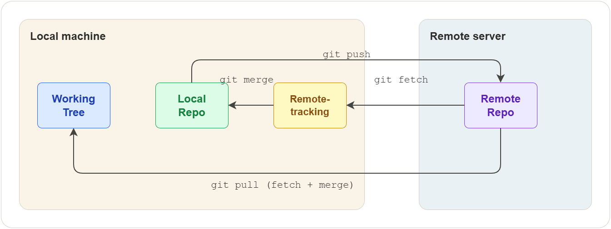
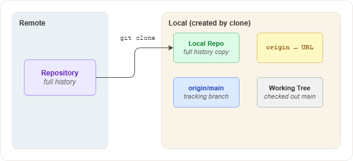
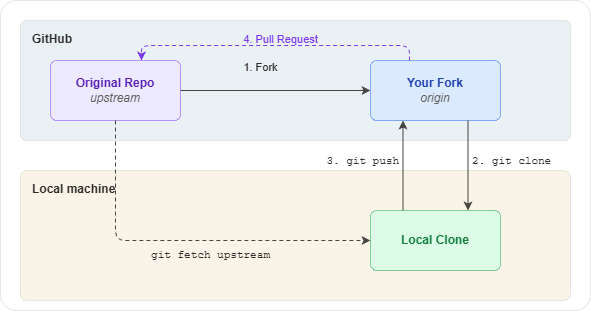

## Overview

This chapter covers how Git communicates with remote repositories —
fetching changes others have made, pushing your own work, and keeping
local and remote branches in sync. These are the operations that turn
Git from a local history tool into a collaboration platform.

The basics of connecting to a remote were introduced in
[Introduction](01-introduction.md) (Exercise 6). This chapter goes
deeper into the mechanics and the workflows you will use daily.



## Remote Branches

A remote is a named reference to another repository, usually hosted on
a service like GitHub, GitLab, or Bitbucket. When you clone a
repository, Git automatically creates a remote called `origin` that
points to the URL you cloned from.

### Listing remotes

```shell
$ git remote             # list remote names
$ git remote -v          # list names with URLs
```

Example output:

```
origin  https://github.com/user/project.git (fetch)
origin  https://github.com/user/project.git (push)
```

The fetch and push URLs are usually the same, but they can differ.

### Adding a remote

```shell
$ git remote add upstream https://github.com/original/project.git
```

This registers a new remote called `upstream`. You can choose any name,
but `origin` and `upstream` are conventional:

| Name       | Convention                                    |
|------------|-----------------------------------------------|
| `origin`   | Your own copy (the one you cloned or created) |
| `upstream` | The original repository you forked from       |

### Renaming and removing remotes

```shell
$ git remote rename old-name new-name
$ git remote remove upstream
```

Removing a remote also deletes all its remote-tracking branches.

### Checking sync status

For every branch on a remote, Git keeps a local read-only reference
called a remote-tracking branch. These follow the pattern
`<remote>/<branch>`:

```
origin/main
origin/feature
upstream/main
```

As covered in [Building Blocks](02-building-blocks.md), these references
live in `.git/refs/remotes/`. They are updated automatically by `fetch`
and `pull`, never by your local commits.

```shell
$ git branch -vv
```

This shows each local branch, its tracking relationship, and whether
it is ahead, behind, or diverged:

```
* main     abc1234 [origin/main] Latest commit message
  feature  def5678 [origin/feature: ahead 2] Work in progress
```

| Status            | Meaning                                       |
|-------------------|-----------------------------------------------|
| ahead 2           | You have 2 local commits not yet pushed       |
| behind 3          | The remote has 3 commits you have not fetched |
| ahead 1, behind 2 | Both sides have new commits (diverged)        |

## Cloning

Cloning creates a local copy of a remote repository. It downloads the
full history, sets up `origin` pointing to the source URL, creates
remote-tracking branches for every remote branch, and checks out the
default branch.



```shell
$ git clone https://github.com/user/project.git
$ git clone https://github.com/user/project.git my-folder   # custom directory name
```

Git supports two URL protocols:

| Protocol | URL format                         | Notes                                       |
|----------|------------------------------------|---------------------------------------------|
| HTTPS    | `https://github.com/user/repo.git` | Works everywhere, prompts for credentials   |
| SSH      | `git@github.com:user/repo.git`     | Requires SSH key setup, no password prompts |

HTTPS is simpler to start with. SSH is covered in the
[Appendix](08-appendix.md).

## Fetching

Fetching downloads commits, branches, and tags from a remote and
updates the remote-tracking branches. It does not modify your working
tree or local branches.

```shell
$ git fetch origin             # fetch all branches from origin
$ git fetch origin main        # fetch only the main branch
$ git fetch --all              # fetch from all configured remotes
```

After fetching, you can inspect what changed before deciding to
integrate:

```shell
$ git log main..origin/main    # commits on remote that you don't have
$ git diff main origin/main    # line-by-line differences
```

Fetching is always safe — it never changes your local branches or
working tree.

## Pulling

Pulling combines two operations in one command: fetch followed by merge.

```shell
$ git pull origin main             # equivalent to fetch + merge
```

### Pull with rebase

By default, `git pull` creates a merge commit when your branch has
diverged from the remote. To produce a linear history instead, use
rebase:

```shell
$ git pull --rebase origin main
```

This replays your local commits on top of the remote changes, avoiding
the merge commit. Many teams prefer this for feature branches to keep
the history clean.

To make rebase the default pull strategy:

```shell
$ git config --global pull.rebase true
```

### Handling pull conflicts

If the remote changes conflict with your local changes, Git stops and
asks you to resolve the conflict — the same process described in
[Branching and Merging](03-branching-and-merging.md#conflicts). After
resolving:

```shell
$ git add <resolved-file>
$ git commit                    # if pulling with merge
$ git rebase --continue         # if pulling with rebase
```

## Pushing

Pushing uploads your local commits to a remote branch. The remote
branch is updated to match your local branch.

```shell
$ git push origin main
```

### Setting upstream tracking

The `-u` flag links your local branch to a remote branch so that
future `push` and `pull` commands work without specifying the remote
and branch name:

```shell
$ git push -u origin feature    # first push — sets up tracking
$ git push                      # subsequent pushes — no arguments needed
```

### Rejected pushes

A push is rejected when the remote branch has commits that your local
branch does not have:

```
! [rejected]        main -> main (non-fast-forward)
```

This means someone else pushed changes since your last fetch. To fix
this:

1. Pull the remote changes: `git pull origin main`
2. Resolve any conflicts
3. Push again: `git push origin main`

### Force pushing

Force pushing overwrites the remote branch with your local history:

| Command                       | Behavior                                              |
|-------------------------------|-------------------------------------------------------|
| `git push --force`            | Overwrites unconditionally — can discard others' work |
| `git push --force-with-lease` | Fails if someone else pushed since your last fetch    |

Always prefer `--force-with-lease` over `--force`.

> **Warning:** Never force push to shared branches like `main`. It
> rewrites history for everyone and can cause data loss. Use force push
> only on your own feature branches.

## Forking

Forking is a hosting-platform feature (not a Git command) that creates
your own copy of someone else's repository under your account. This is
the standard way to contribute to projects you do not have write access
to.



### Setup

1. **Fork** the repository on the hosting platform (e.g. GitHub)
2. **Clone** your fork locally:
   ```shell
   $ git clone https://github.com/you/project.git
   ```
3. **Add the original as upstream**:
   ```shell
   $ git remote add upstream https://github.com/original/project.git
   ```

### Contributing

1. Create a feature branch from an up-to-date `main`:
   ```shell
   $ git fetch upstream
   $ git switch -c feature/my-change upstream/main
   ```
2. Make your changes and commit
3. Push to your fork:
   ```shell
   $ git push -u origin feature/my-change
   ```
4. Open a **pull request** from your fork's branch to the original
   repository's `main` branch

### Keeping your fork in sync

```shell
$ git fetch upstream
$ git switch main
$ git merge upstream/main
$ git push origin main
```

This pulls the latest changes from the original repository into your
fork. Do this regularly to avoid large divergences.

## Exercises

All exercises use the `concepts-lab` repository from previous chapters.

### Exercise 1: Clone and inspect a repository

**Task:** Clone a repository and explore what Git sets up automatically.

**Steps:**

1. On GitHub, create a new repository called `clone-lab` with a README
2. Clone it locally: `git clone <url> clone-lab`
3. Enter the directory and run `git remote -v`
4. Run `git branch -vv` to see the tracking relationship
5. Run `git log --oneline` to confirm the initial commit is present
6. List the remote-tracking branches: `git branch -r`
7. Inspect `.git/refs/remotes/origin/` to see the tracking reference

**Verify:**

`git remote -v` shows `origin` pointing to your GitHub URL.
`git branch -vv` shows `main` tracking `origin/main`.
`git branch -r` lists `origin/main`.

### Exercise 2: Fetch and inspect before merging

**Task:** Practice the fetch-then-inspect workflow instead of pulling
directly.

**Steps:**

1. On GitHub, edit a file directly in the browser on the `main` branch
   (add a comment line to any file) and commit the change
2. Back in your terminal, run `git fetch origin`
3. Run `git log main..origin/main --oneline` to see what changed
4. Run `git diff main origin/main` to see the exact differences
5. Once satisfied, run `git merge origin/main` to integrate the changes
6. Confirm with `git log --oneline` that the remote commit is now in
   your local history

**Verify:**

After merging, `git status` shows your branch is up to date with
`origin/main`. The commit made on GitHub appears in `git log`.

### Exercise 3: Handle a rejected push

**Task:** Simulate a rejected push and resolve it.

**Steps:**

1. On GitHub, edit a file on `main` and commit (simulating a teammate's
   push)
2. Locally, edit a different file on `main` and commit
3. Run `git push origin main` — it should be rejected with
   `non-fast-forward`
4. Run `git pull origin main` to fetch and merge the remote changes
5. If there are no conflicts, Git creates a merge commit automatically
6. Run `git push origin main` — it should succeed
7. Run `git log --oneline --graph` to see the merge in history

**Verify:**

`git log --graph` shows the divergence and merge. `git status` reports
the branch is up to date with `origin/main`.

### Exercise 4: Push with upstream tracking

**Task:** Set up upstream tracking and verify it simplifies push/pull.

**Steps:**

1. In `concepts-lab`, create and switch to a new branch `feature/tracking`
2. Create a file `tracking.txt`, stage and commit
3. Push with the `-u` flag: `git push -u origin feature/tracking`
4. Run `git branch -vv` to confirm the tracking relationship
5. Make another change, commit, and run `git push` with no arguments
6. Confirm the push succeeded without specifying remote or branch

**Verify:**

`git branch -vv` shows `feature/tracking` tracking `origin/feature/tracking`.
The second push works with no arguments.

### Exercise 5: Fork and contribute

**Task:** Practice the forking workflow using your own `concepts-lab`
repository as the "original" project.

**Steps:**

1. On GitHub, open `concepts-lab` and click "Fork" to create a fork
   under your own account (GitHub allows forking your own repos into
   an organization, or you can use a second account)
2. Clone the fork locally into a new directory:
   `git clone <fork-url> concepts-lab-fork`
3. Enter the directory and add the original as upstream:
   `git remote add upstream <original-url>`
4. Verify with `git remote -v` — you should see both `origin` (fork)
   and `upstream` (original)
5. Create a feature branch: `git switch -c feature/fork-test`
6. Create a file `fork-test.txt`, commit it, and push to your fork:
   `git push -u origin feature/fork-test`
7. On GitHub, open a pull request from the fork's branch to the
   original repository

**Verify:**

`git remote -v` shows two remotes. The pull request appears on the
original repository's GitHub page.

## Quiz

**Q1.** What does `git clone` set up automatically?

- A) Only the working tree — no remote or tracking branches
- B) A local copy, an `origin` remote, and remote-tracking branches
- C) A bare repository with no working tree
- D) A fork on the hosting platform

**Q2.** What does `git fetch` do?

- A) Downloads remote changes and merges them into your branch
- B) Downloads remote changes and updates remote-tracking branches only
- C) Pushes local changes to the remote
- D) Deletes remote branches that no longer exist

**Q3.** What is the difference between `git pull` and `git fetch`?

- A) They are identical commands
- B) `pull` only downloads; `fetch` also merges
- C) `pull` fetches and then merges; `fetch` only downloads
- D) `pull` works with tags; `fetch` works with branches

**Q4.** Why might a `git push` be rejected?

- A) The remote repository is read-only
- B) The remote branch has commits that your local branch does not have
- C) Your local branch is ahead of the remote
- D) You forgot to run `git add` first

**Q5.** What is the advantage of `--force-with-lease` over `--force`?

- A) It is faster
- B) It fails if someone else pushed since your last fetch
- C) It pushes all branches at once
- D) It creates a merge commit on the remote

**Q6.** What does `git push -u origin feature` do that `git push origin
feature` does not?

- A) It creates the branch on the remote
- B) It forces the push even if rejected
- C) It sets up tracking so future pushes need no arguments
- D) It pushes all branches at once

**Q7.** In the forking workflow, what is the conventional name for the
original repository's remote?

- A) origin
- B) source
- C) upstream
- D) base

### Answers

1. B — A local copy, an `origin` remote, and remote-tracking branches
2. B — Downloads remote changes and updates remote-tracking branches only
3. C — `pull` fetches and then merges; `fetch` only downloads
4. B — The remote branch has commits that your local branch does not have
5. B — It fails if someone else pushed since your last fetch
6. C — It sets up tracking so future pushes need no arguments
7. C — upstream
