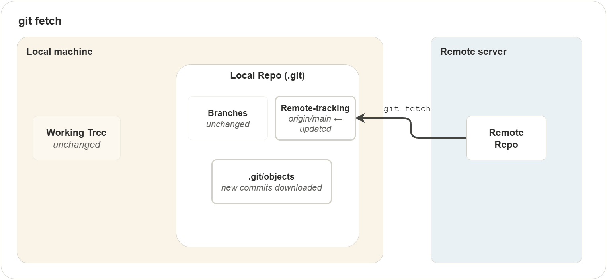
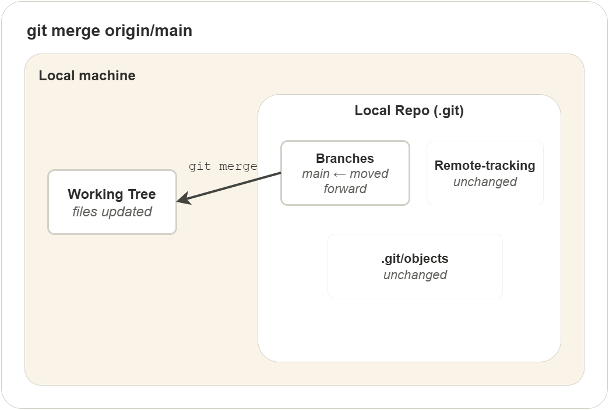
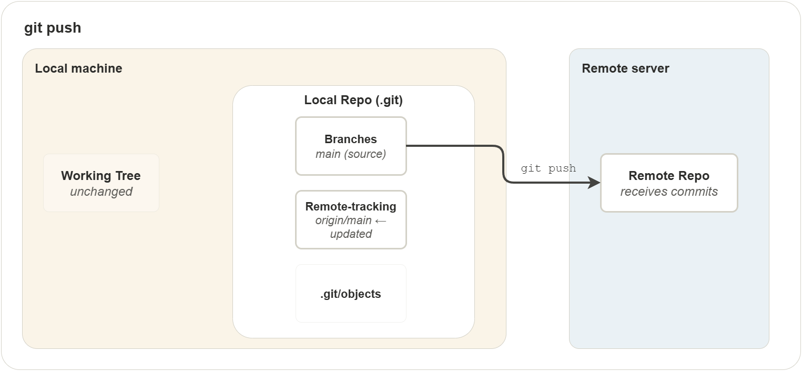

## 1. Overview

So far, everything you have done with Git has been local — on your own
machine, in your own repository. This chapter introduces the other side
of Git: working with remote repositories. A remote repository is a copy
of your project hosted on another machine, usually a server like GitHub,
GitLab, or Bitbucket.

Remote repositories are what make collaboration possible. They let you
share your work with others, download their changes, and keep everyone
in sync.

In this chapter you will learn:

- What a remote is and where Git stores remote information
- How cloning creates a local copy with everything set up
- How fetching downloads changes without touching your files
- How merging brings fetched changes into your working tree
- How pulling combines fetch and merge in one step
- How pushing sends your commits to the remote
- How forking lets you contribute to projects you do not own

The diagram below shows the full picture. Each operation is explained
in detail in the sections that follow.


## 2. Remotes and Tracking

Before you can fetch or push, Git needs to know where the remote
repository is. This section explains how Git stores that information.

### What is a remote?

A remote is a named reference to another repository. It has a name
(like `origin`) and a URL (like `https://github.com/user/project.git`).
Think of it as a bookmark that tells Git "this is where the other copy
of the project lives."

### Where remotes are stored

Git stores remote information in `.git/config`. When you add a remote,
Git writes an entry like this:

```
[remote "origin"]
    url = https://github.com/user/project.git
    fetch = +refs/heads/*:refs/remotes/origin/*
```

The `url` is the address of the remote repository. The `fetch` line
tells Git how to map remote branches to local references:

```
+refs/heads/*:refs/remotes/origin/*
│    │              │
│    │              └─ store them locally under refs/remotes/origin/
│    └─ take every branch on the remote (refs/heads/*)
└─ + means always update, even if history diverged
```

For example, when you run `git fetch origin`, Git takes the remote's
`refs/heads/main` and stores it locally as `refs/remotes/origin/main`.
The remote's `refs/heads/feature` becomes `refs/remotes/origin/feature`,
and so on.

### Remote-tracking branches

For every branch on a remote, Git keeps a local read-only reference
called a remote-tracking branch. These follow the pattern
`<remote>/<branch>`:

```
.git/refs/remotes/
├── origin/
│   ├── HEAD        ← symbolic ref to the remote's default branch
│   ├── main
│   └── feature
└── upstream/
    └── main
```

These references live inside your local repository. They are snapshots
of where each branch was on the remote the last time you communicated
with it.

Key points about remote-tracking branches:

- They are **read-only** — you cannot commit to them directly
- `git fetch` updates them to match the current state of the remote
  (e.g. if someone pushed a new commit to `main`, fetch moves
  `origin/main` forward)
- `git push` also updates them — after a successful push, Git moves
  `origin/main` to match your local `main`, since the remote now has
  your commits
- They let you compare your local work with the remote state

### Branch tracking configuration

Git also stores which local branch is linked to which remote-tracking
branch. This is written to `.git/config` when you clone or push with
`-u`:

```
[branch "main"]
    remote = origin
    merge = refs/heads/main
```

This tells Git: when you are on `main` and run `git pull` or `git push`
with no arguments, use `origin` as the remote and `refs/heads/main` as
the branch to sync with. Here is the full chain of what happens during
a `git pull`:

1. Read section `[branch "main"]` — use remote `origin`, branch `refs/heads/main`
2. Read section `[remote "origin"]` — look up the URL
3. Fetch `refs/heads/main` from that URL
4. Store it locally as `refs/remotes/origin/main` (using the refspec)
5. Merge `refs/remotes/origin/main` into your local `refs/heads/main`
6. Update the working tree to reflect the merged state

### Checking sync status

```text
$ git branch -vv
```

This shows each local branch, its tracking relationship, and whether
it is ahead, behind, or diverged:

```
* main     abc1234 [origin/main] Latest commit message
  feature  def5678 [origin/feature: ahead 2] Work in progress
```

| Status            | Meaning                                       |
|-------------------|-----------------------------------------------|
| ahead 2           | You have 2 local commits not yet pushed       |
| behind 3          | The remote has 3 commits you have not fetched |
| ahead 1, behind 2 | Both sides have new commits (diverged)        |

### Managing remotes

```text
$ git remote             # list remote names
$ git remote -v          # list names with URLs
```

Example output:

```
origin  https://github.com/user/project.git (fetch)
origin  https://github.com/user/project.git (push)
```

To add a new remote:

```text
$ git remote add upstream https://github.com/original/project.git
```

This adds a new `[remote "upstream"]` section to `.git/config`. You
can choose any name, but `origin` and `upstream` are conventional:

| Name       | Convention                                    |
|------------|-----------------------------------------------|
| `origin`   | Your own copy (the one you cloned or created) |
| `upstream` | The original repository you forked from       |

To rename or remove a remote:

```text
$ git remote rename old-name new-name
$ git remote remove upstream
```

Removing a remote also deletes all its remote-tracking branches.

## 3. Cloning

Cloning is usually the first step when working with a remote
repository. It creates a complete local copy of the project — all
files, all history, all branches.


When you run `git clone`, Git does the following:

1. Creates a new directory with the project name
2. Initializes a `.git/` directory inside it
3. Downloads the entire commit history into `.git/objects/`
4. Creates a remote called `origin` pointing to the source URL
5. Creates remote-tracking branches for every branch on the remote
   (e.g. `origin/main`)
6. Creates a local `main` branch that tracks `origin/main`
7. Checks out `main` into the working tree

After cloning, your local repository is a fully independent copy. You
can work offline, make commits, and create branches — all without
contacting the remote.

```text
$ git clone https://github.com/user/project.git
$ git clone https://github.com/user/project.git my-folder   # custom directory name
```

Git supports two URL protocols:

| Protocol | URL format                         | Notes                                       |
|----------|------------------------------------|---------------------------------------------|
| HTTPS    | `https://github.com/user/repo.git` | Works everywhere, prompts for credentials   |
| SSH      | `git@github.com:user/repo.git`     | Requires SSH key setup, no password prompts |

HTTPS is simpler to start with. SSH is covered in the
[Appendix](08-appendix.md).

## 4. Fetching

After cloning, time passes. Other people push changes to the remote.
Your local copy falls behind. Fetching is how you download those
changes.

`git fetch` contacts the remote, downloads any new commits, and
updates your remote-tracking branches. That is all it does. It does
**not** change your working tree, your local branches, or your staging
area.



The diagram highlights what changes and what stays the same:

- **Remote-tracking branches** — updated (e.g. `origin/main` moves
  forward to match the remote)
- **.git/objects** — new commit, tree, and blob objects are downloaded
- **Your branches** — unchanged
- **Your working tree** — unchanged
- **Your staging area** — unchanged

This is what makes `git fetch` safe. You can run it at any time without
risking your current work.

```text
$ git fetch origin             # fetch all branches from origin
$ git fetch origin main        # fetch only the main branch
$ git fetch --all              # fetch from all configured remotes
```

After fetching, you can inspect what changed before deciding to
integrate:

```text
$ git log main..origin/main    # commits on remote that you don't have
$ git diff main origin/main    # line-by-line differences
```

## 5. Merging Remote Changes

After fetching, your remote-tracking branches are up to date, but your
local branches and working tree have not changed. To bring the fetched
changes into your working tree, you merge.

```text
$ git merge origin/main
```

This merges the remote-tracking branch `origin/main` into your current
branch (usually `main`).



The diagram highlights what changes:

- **Your branch ref** — `main` moves forward to include the new commits
- **Your working tree** — files are updated to reflect the merged state
- **Remote-tracking branches** — unchanged (they were already updated
  by fetch)

If your local branch has no commits that the remote does not have, Git
performs a fast-forward merge — it simply moves the branch pointer
forward. No merge commit is created.

If both sides have new commits, Git creates a merge commit, just like
merging any two branches (see
[Branching and Merging](03-branching-and-merging.md#merging)).

### Handling conflicts

If the remote changes conflict with your local changes, Git stops and
asks you to resolve — the same process described in
[Branching and Merging](03-branching-and-merging.md#conflicts). After
resolving:

```text
$ git add <resolved-file>
$ git commit
```

## 6. Pulling

Now that you understand fetch and merge separately, pulling is simple:
`git pull` is just `git fetch` followed by `git merge`, combined into
one command.

```text
$ git pull origin main
```

This is equivalent to:

```text
$ git fetch origin main
$ git merge origin/main
```

When you run `git pull` with no arguments, Git uses the branch tracking
configuration in `.git/config` to determine the remote and branch
automatically (see [Branch tracking configuration](#branch-tracking-configuration)
in section 2).

When should you use `git pull` versus `git fetch` + `git merge`
separately?

- **Use `git pull`** when you trust that the merge will be
  straightforward and want to save a step
- **Use `git fetch` first** when you want to inspect what changed
  before integrating, or when you suspect conflicts

### Pull with rebase

By default, `git pull` creates a merge commit when your branch has
diverged from the remote. To produce a linear history instead, use
rebase:

```text
$ git pull --rebase origin main
```

This replays your local commits on top of the remote changes, avoiding
the merge commit. Many teams prefer this for feature branches to keep
the history clean.

To make rebase the default pull strategy:

```text
$ git config --global pull.rebase true
```

## 7. Pushing

Pushing is the reverse of fetching — it uploads your local commits to
the remote repository.



The diagram highlights what changes:

- **Remote Repo** — receives your new commits
- **Remote-tracking branch** — `origin/main` is updated to match your
  local branch
- **Your working tree** — unchanged
- **Your branches** — unchanged

```text
$ git push origin main
```

### Setting upstream tracking

The `-u` flag links your local branch to a remote branch so that
future `push` and `pull` commands work without specifying the remote
and branch name:

```text
$ git push -u origin feature    # first push — sets up tracking
$ git push                      # subsequent pushes — no arguments needed
```

### Rejected pushes

A push is rejected when the remote branch has commits that your local
branch does not have:

```
! [rejected]        main -> main (non-fast-forward)
```

This means someone else pushed changes since your last fetch. To fix
this:

1. Pull the remote changes: `git pull origin main`
2. Resolve any conflicts
3. Push again: `git push origin main`

### Force pushing

Force pushing overwrites the remote branch with your local history:

| Command                       | Behavior                                              |
|-------------------------------|-------------------------------------------------------|
| `git push --force`            | Overwrites unconditionally — can discard others' work |
| `git push --force-with-lease` | Fails if someone else pushed since your last fetch    |

Always prefer `--force-with-lease` over `--force`.

> **Warning:** Never force push to shared branches like `main`. It
> rewrites history for everyone and can cause data loss. Use force push
> only on your own feature branches.

## 8. Forking

Forking is a hosting-platform feature (not a Git command) that creates
your own copy of someone else's repository under your account. This is
the standard way to contribute to projects you do not have write access
to.


### Setup

1. **Fork** the repository on the hosting platform (e.g. GitHub)
2. **Clone** your fork locally:
   ```shell
   $ git clone https://github.com/you/project.git
   ```
3. **Add the original as upstream**:
   ```shell
   $ git remote add upstream https://github.com/original/project.git
   ```

### Contributing

1. Create a feature branch from an up-to-date `main`:
   ```shell
   $ git fetch upstream
   $ git switch -c feature/my-change upstream/main
   ```
2. Make your changes and commit
3. Push to your fork:
   ```shell
   $ git push -u origin feature/my-change
   ```
4. Open a **pull request** from your fork's branch to the original
   repository's `main` branch

### Keeping your fork in sync

```text
$ git fetch upstream
$ git switch main
$ git merge upstream/main
$ git push origin main
```

This pulls the latest changes from the original repository into your
fork. Do this regularly to avoid large divergences.

## Exercises

All exercises use the `concepts-lab` repository from previous chapters.

### Exercise 1: Clone and inspect a repository

**Task:** Clone a repository and explore what Git sets up automatically.

**Steps:**

1. On GitHub, create a new repository called `clone-lab` with a README
2. Clone it locally: `git clone <url> clone-lab`
3. Enter the directory and run `git remote -v`
4. Run `git branch -vv` to see the tracking relationship
5. Run `git log --oneline` to confirm the initial commit is present
6. List the remote-tracking branches: `git branch -r`
7. Inspect `.git/refs/remotes/origin/` to see the tracking reference
8. Open `.git/config` and find the `[remote "origin"]` section

**Verify:**

`git remote -v` shows `origin` pointing to your GitHub URL.
`git branch -vv` shows `main` tracking `origin/main`.
`.git/config` contains the remote URL and fetch refspec.

### Exercise 2: Fetch and inspect before merging

**Task:** Practice the fetch-then-inspect workflow instead of pulling
directly.

**Steps:**

1. On GitHub, edit a file directly in the browser on the `main` branch
   (add a comment line to any file) and commit the change
2. Back in your terminal, run `git fetch origin`
3. Run `git log main..origin/main --oneline` to see what changed
4. Run `git diff main origin/main` to see the exact differences
5. Once satisfied, run `git merge origin/main` to integrate the changes
6. Confirm with `git log --oneline` that the remote commit is now in
   your local history

**Verify:**

After merging, `git status` shows your branch is up to date with
`origin/main`. The commit made on GitHub appears in `git log`.

### Exercise 3: Handle a rejected push

**Task:** Simulate a rejected push and resolve it.

**Steps:**

1. On GitHub, edit a file on `main` and commit (simulating a teammate's
   push)
2. Locally, edit a different file on `main` and commit
3. Run `git push origin main` — it should be rejected with
   `non-fast-forward`
4. Run `git pull origin main` to fetch and merge the remote changes
5. If there are no conflicts, Git creates a merge commit automatically
6. Run `git push origin main` — it should succeed
7. Run `git log --oneline --graph` to see the merge in history

**Verify:**

`git log --graph` shows the divergence and merge. `git status` reports
the branch is up to date with `origin/main`.

### Exercise 4: Push with upstream tracking

**Task:** Set up upstream tracking and verify it simplifies push/pull.

**Steps:**

1. In `concepts-lab`, create and switch to a new branch `feature/tracking`
2. Create a file `tracking.txt`, stage and commit
3. Push with the `-u` flag: `git push -u origin feature/tracking`
4. Run `git branch -vv` to confirm the tracking relationship
5. Make another change, commit, and run `git push` with no arguments
6. Confirm the push succeeded without specifying remote or branch

**Verify:**

`git branch -vv` shows `feature/tracking` tracking `origin/feature/tracking`.
The second push works with no arguments.

### Exercise 5: Fork and contribute

**Task:** Practice the forking workflow using your own `concepts-lab`
repository as the "original" project.

**Steps:**

1. On GitHub, open `concepts-lab` and click "Fork" to create a fork
   under your own account (GitHub allows forking your own repos into
   an organization, or you can use a second account)
2. Clone the fork locally into a new directory:
   `git clone <fork-url> concepts-lab-fork`
3. Enter the directory and add the original as upstream:
   `git remote add upstream <original-url>`
4. Verify with `git remote -v` — you should see both `origin` (fork)
   and `upstream` (original)
5. Create a feature branch: `git switch -c feature/fork-test`
6. Create a file `fork-test.txt`, commit it, and push to your fork:
   `git push -u origin feature/fork-test`
7. On GitHub, open a pull request from the fork's branch to the
   original repository

**Verify:**

`git remote -v` shows two remotes. The pull request appears on the
original repository's GitHub page.

## Quiz

**Q1.** What does `git clone` set up automatically?

- A) Only the working tree — no remote or tracking branches
- B) A local copy, an `origin` remote, and remote-tracking branches
- C) A bare repository with no working tree
- D) A fork on the hosting platform

**Q2.** Where does Git store remote configuration?

- A) In the working tree
- B) In `.git/config`
- C) In a separate `.remotes` file
- D) On the remote server

**Q3.** What does `git fetch` change on your machine?

- A) Your working tree and local branches
- B) Only your working tree
- C) Remote-tracking branches and `.git/objects`
- D) Nothing — it only checks for updates

**Q4.** After running `git fetch`, how do you bring the changes into
your working tree?

- A) Run `git fetch` again with `--apply`
- B) Run `git merge origin/main`
- C) Run `git push`
- D) The changes are already in your working tree

**Q5.** What is `git pull` equivalent to?

- A) `git fetch` only
- B) `git merge` only
- C) `git fetch` followed by `git merge`
- D) `git push` followed by `git fetch`

**Q6.** Why might a `git push` be rejected?

- A) The remote repository is read-only
- B) The remote branch has commits that your local branch does not have
- C) Your local branch is ahead of the remote
- D) You forgot to run `git add` first

**Q7.** What is the advantage of `--force-with-lease` over `--force`?

- A) It is faster
- B) It fails if someone else pushed since your last fetch
- C) It pushes all branches at once
- D) It creates a merge commit on the remote

**Q8.** In the forking workflow, what is the conventional name for the
original repository's remote?

- A) origin
- B) source
- C) upstream
- D) base

### Answers

1. B — A local copy, an `origin` remote, and remote-tracking branches
2. B — Git stores remote names, URLs, and fetch rules in `.git/config`
3. C — Fetch downloads new objects and updates remote-tracking branches
4. B — Run `git merge origin/main` to integrate fetched changes
5. C — `pull` fetches and then merges in one step
6. B — The remote branch has commits that your local branch does not have
7. B — It fails if someone else pushed since your last fetch
8. C — upstream
