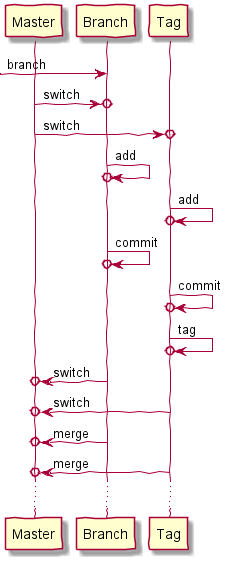

# Git Tutorial

## Git Overview

________________________________________________________________________________

- Code is secured against system failure
- Code changes are organized and can be traced
- Changes can be first reviewed and then saved
- Source code can easily be tagged, branched and merged
- Used for planning and management of software projects

## Git Installation

> TODO: Describe briefly how to install git 
> 
> - [ ] Download and install Git
> - [ ] Download and install a git client
> - [ ] Choose git hosting platform

## Git Dataflow

________________________________________________________________________________

### Repository

This is the **.git** directory in the project. It contains the files as well as
the history of the changes made to those files. The repository can be either **
local** or **remote**, whereby for git both types of repositories are absolutely
equivalent.

### Workspace

When you work on your project and make some changes, you are dealing with your
project's working directory on your computer's filesystem. All the changes you
make will remain in the working directory until you add them to the staging area
or discard them.

### Index

The staging area or also index is the place where the developer gathers the
changes before commit. It is the place where the developer can review the
changes before transferring the data to the local repository and acts as an
additional layer of security.

### Practice

1. Create the remote repository
2. Clone the remote repository
3. Create a new file and add it to the index
4. Commit the file to the local repo
5. Push the file to the remote repo
6. Make a change in the file from the remote repo
7. Pull the changes from the remote repo

## Git Layout

As seen in the git dataflow, there are two types of repositories: remote and
local. The remote repository is often a **bare repository**. It is 
the git repository itself without any project files. As git doesn't allow 
changes to this directory using git commands, it is considered safe for 
public use.

> TODO: Insert here a picture of the remote repository layout

For example ***git clone <project.git>*** will copy the bare repository 
***project.git*** as a hidden .git folder and create the project files from the 
latest commit. The local repository will have also the project files, or 
also the so called ***working tree***.

> TODO: Insert here a picture of the local repository layout

### Practice
1. Create a bare repository
2. Check the folder structure
3. Try to add some changes and commit to this folder
4. Clone the bare repository
5. Check the folder structure
6. Try to add some changes and commit to this folder

## Git Configuration

Git offers three levels of configuration: ***local***, ***global*** and 
***system***.

- Configuration on the local level will affect only this repository. 
- Configuration on the global level will affect the current user.
- Configuration on the system level will affect all the users

> TODO: Maybe a picture will be better here. It should show the typical 
> use cases for local (aliases, coloring), global (user) and system (editor)
> configuration scenarios.

### Practice
1. Make a local configuration of the email for the current repo
2. Go to .git and check the configuration file
3. Make a global configuration of the username
4. Go to the global configuration file and check the username
5. Make a system configuration of the editor
6. Go to the system configuration file and check the editor

## Git Operations

### Setting up a new repository

This section describes the most commonly used commands to create and set up a
repository of any kind. The descriptions are only for reference purposes only,
for details visit the official site
<https://git-scm.com>.

#### Creating a new bare repository without project files

    PS> git init --bare <project>.git
    PS> cd project.git
    PS> dir

#### Creating a new repository with project files

    PS> git init <project>
    PS> cd project
    PS> cd .git
    PS> dir

#### Copy a bare repository

    PS> git clone --bare <https://github.com/user/project.git>
    PS> cd project.git
    PS> dir

#### Copy a bare repository with project files

    PS> git clone <https://github.com/user/project.git>
    PS> cd project
    PS> dir

#### Configuration levels of a repository

    PS> git config --local user.email <email>   // Only this repository
    PS> git config --global user.email <email>  // All repositories of the user
    PS> git config --system user.email <email>  // All the users and all repositories

#### Create a new command alias

    PS> git config --global alias.<alias> <command>
    PS> git config --global alias.unstage 'reset --HEAD --'

#### Configure the editor

    PS> git config --global core.editor <editor + options>

#### Configure the merge tool

    PS> git config --globaal merge.tool <merge tool>

### Saving changes

### Inspecting a repository

### Reverting changes

### Manipulating history

### Syncing repositories

### Creating and using branches

### Migrating a repository

## Git Commands

________________________________________________________________________________

### git init

    git init --bare

### git clone

    git clone https://github.com/user/project/repo.git

### git config

    git config --global user.name "user"
    git config --global user.email "user@mail.com"
    git config --global core.editor ".../editor.exe [options]"
    git config --list

### git add

### git commit

### git push

### git pull

### git branch

### git tag

### git merge

### git remote

### git status

### git log

### git blame

## Git Objects

________________________________________________________________________________

Git uses the SHA-1 hash of content to create references to commit, trees and
blobs.

#### Commit object

Store the metadata about a commit, such as the parent, the author, timestamps
and references to the file tree of this commit.

#### Tree object

A collection of references to either child trees or blob objects.

#### Blob objects

Binary large objects or BLOBS are compressed files and the end of the tree
structure.

## Git Terms

________________________________________________________________________________

### HEAD

The HEAD is a pointer to a commit object in a branch we are working on. Usually
it points to the most recent commit in the current branch, but the HEAD can also
point to any particular commit from the commit history. In this case the HEAD
is ***detached***.

### Origin

The name or alias of the link to the remote repository for pull operations. For
example the clone of the remote link is usually something
like https://github.com/user/project/repo.git. Internally git replaces this link
with ***origin***.

### Downstream

The flow of data from the original repository to the cloned repository.

### Upstream

The flow of data from the cloned repository to the original repository.

### Pull/Merge Request

Originally a GitHub specific term for merge requests from the side of view of
the owner of the repository. Someone has pushed commits and want you to check
them and merge them with the repository. Other hosting platforms like GitLab
prefer to use the more meaningful name ***Merge Request***.

## Git Notes

________________________________________________________________________________

- In Git, you cannot commit empty folders, because Git does not actually save
  folders, only files. You'll have to create a placeholder file inside those
  directories if you actually want them to be "empty" (i.e. you have no
  committable content).

- If you’ve used SVN the past, it’s important not to confuse the git add command
  with svn add. With the svn add command, you can add a file to a repository.
  Instead, the git add command itself does not directly impact the repository at
  all. It isn’t until you use the git commit command that the changes are
  recorded in your repo. You’ll need to use git add each time you update a file.

- Check your commit history in GitHub
  with https://github.com/<user>/<repository>/commits

- Browse repositories in BitBucket with https://bitbucket.org/repo/all

## Git Hosting

________________________________________________________________________________

### Hosting Services

- https://github.com/
- https://bitbucket.org/
- https://about.gitlab.com/

### Comparison

- https://jelvix.com/blog/bitbucket-vs-github-vs-gitlab
- https://www.geeksforgeeks.org/difference-between-bitbucket-and-github/
- https://medium.com/geekculture/bitbucket-vs-github-vs-gitlab-detailed-comparison-a02dfbe7a624
- https://www.g2.com/products/github/competitors/alternatives
- https://www.g2.com/compare/bitbucket-vs-github-vs-gitlab
- https://disbug.io/en/blog/github-vs-gitlab-vs-bitbucket

### Migration

https://rushabhshah065.medium.com/lets-move-repository-from-bitbucket-to-github-with-all-branches-and-commits-f93c7d3bda67

## Git Clients

________________________________________________________________________________

- https://desktop.github.com/
- https://www.sourcetreeapp.com/
- https://tortoisegit.org/
- https://www.gitkraken.com/
- https://aurees.com/
- https://gitextensions.github.io/

## References

________________________________________________________________________________

### Tutorials

- http://guides.beanstalkapp.com/
- https://www.atlassian.com/git/tutorials/learn-git-with-bitbucket-cloud
- https://www.w3schools.com/git/
- https://www.javatpoint.com/git-init
- http://think-like-a-git.net/
- https://blog.osteele.com/2008/05/my-git-workflow/
- https://tomayko.com/blog/2008/the-thing-about-git
- https://dev.to/shahabbukhari/git-simplified-working-collaboratively-with-gitgithub-5349
- https://mincong.io/2018/04/28/git-index/
- https://opensource.com/article/20/4/git-merge-conflict
- https://backlog.com/git-tutorial/reference/commands/
- https://stackoverflow.com/questions/35979642/what-is-git-tag-how-to-create-tags-how-to-checkout-git-remote-tags/35979751#35979751

### Books

- http://git-scm.com/book/en/v2
- https://www.raywenderlich.com/books/advanced-git/v1.0/chapters/1-how-does-git-actually-work

### Workflows

- https://www.endoflineblog.com/oneflow-a-git-branching-model-and-workflow
- https://nvie.com/posts/a-successful-git-branching-model/
- https://gist.github.com/bryanbraun/8c93e154a93a08794291df1fcdce6918
- https://gist.github.com/jbenet/ee6c9ac48068889b0912
- https://www.toptal.com/software/trunk-based-development-git-flow

### Criticism

- https://stevebennett.me/2012/02/24/10-things-i-hate-about-git/
- https://tom-vykes.medium.com/the-worst-things-about-github-8e8efc60fae3

### Others

- https://www.diagrams.net/