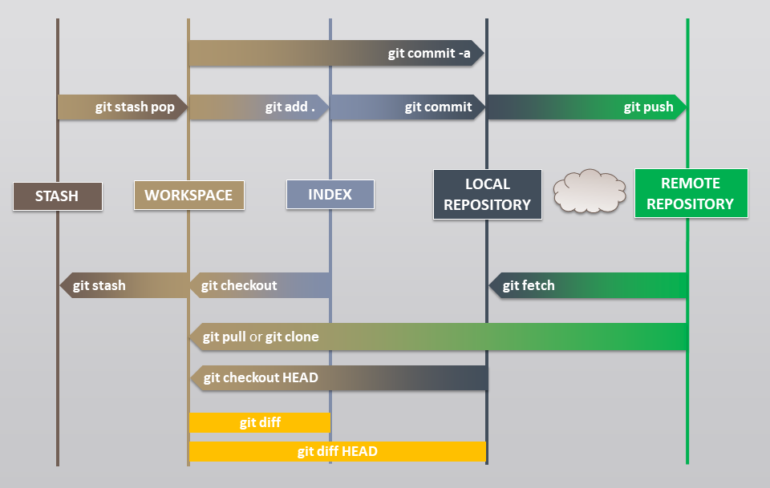

# Git Tutorial

## Table of contents

#### Introduction
- [Git Overview](/01_Git_Introduction/01_git_overview.md)
- [Git Installation for Windows](/01_Git_Introduction/02_git_windows.md)
- [Git Installation for Linux](/01_Git_Introduction/03_git_linux.md)
- [Git Hosting Services](/01_Git_Introduction/04_git_hosting.md)

#### Concepts
- [Dataflow](02_Git_Concepts/01_git_dataflow.md)
- [Repository](02_Git_Concepts/02_git_repository.md)
- [Configuration](02_Git_Concepts/03_git_configuration.md)
- [Objects](02_Git_Concepts/04_git_objects.md)
- [References](02_Git_Concepts/05_git_references.md)
- [Hooks](02_Git_Concepts/06_git_hooks.md)

#### Operations
- [Help](03_Git_Operations/01_Help/readme.md)
- [Setup](03_Git_Operations/02_Setup/readme.md)
- [Configure](03_Git_Operations/03_Configure/readme.md)
- [Save](03_Git_Operations/04_Save/readme.md)
- [Sync](03_Git_Operations/05_Sync/readme.md)
- [Revert](03_Git_Operations/06_Revert/readme.md)
- [Inspect](03_Git_Operations/07_Inspect/readme.md)
- [Tag](03_Git_Operations/08_Tag/readme.md)
- [Branch](03_Git_Operations/09_Branch/readme.md)
- [Merge](03_Git_Operations/10_Merge/readme.md)
- [Rewrite](03_Git_Operations/11_Rewrite/readme.md)
- [Hook](03_Git_Operations/12_Hook/readme.md)

#### Workflows
- [Trunk](04_Git_Workflows/01_trunk.md)
- [Feature](04_Git_Workflows/02_feature.md)
- [Git](04_Git_Workflows/03_git.md)
- [Fork](04_Git_Workflows/04_fork.md)

#### Appendix
- [Dictionary](/05_Appendix/dictionary.md)
- [References](/05_Appendix/references.md)
- [Notes](05_Appendix/notes.md)
- [Clients](05_Appendix/clients.md)

## Contributors
 - [Branimir Georgiev](https://github.com/braboj)
 - [Karim...](https://github.com/Karim06V)
 - [Simeon...](https://github.com/3SGK3)

